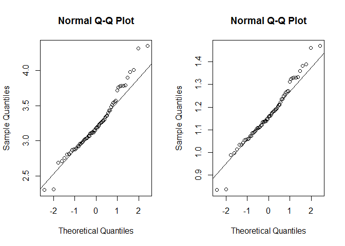
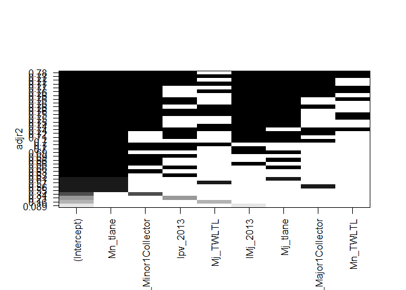
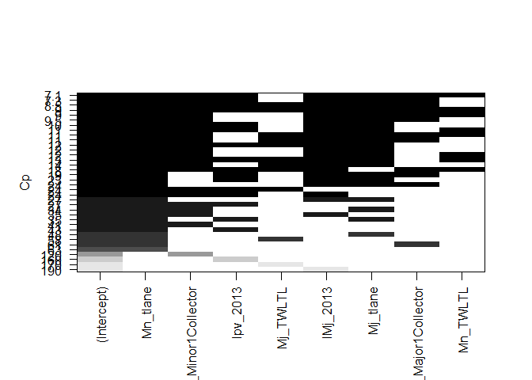
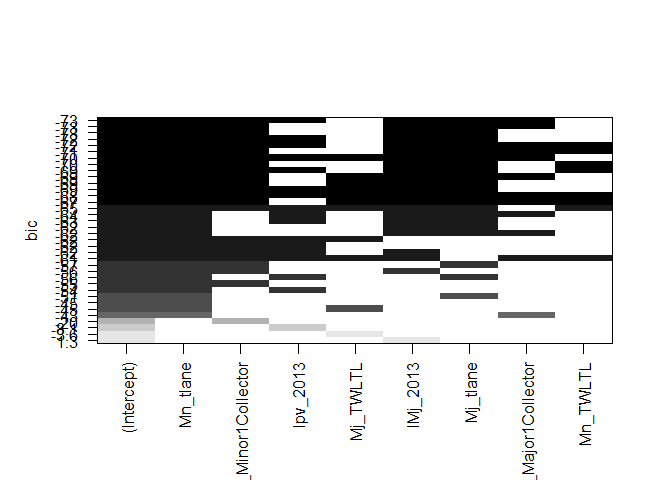
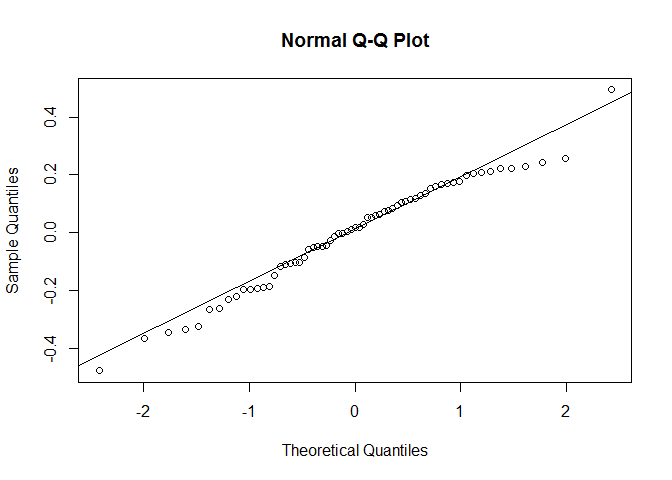
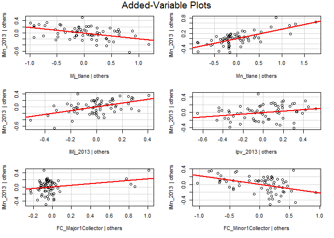
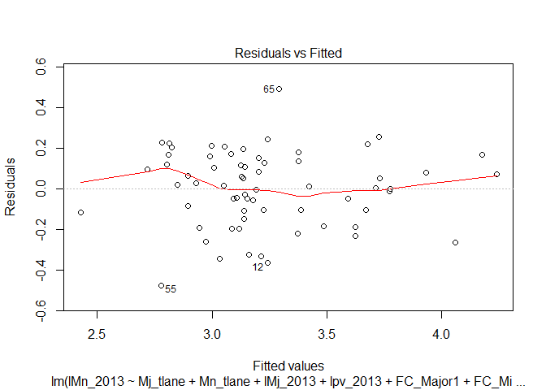
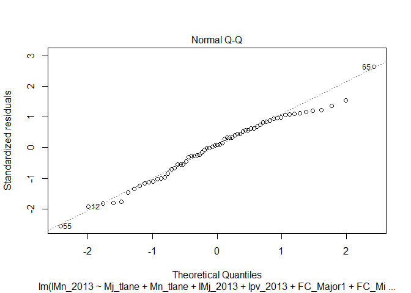
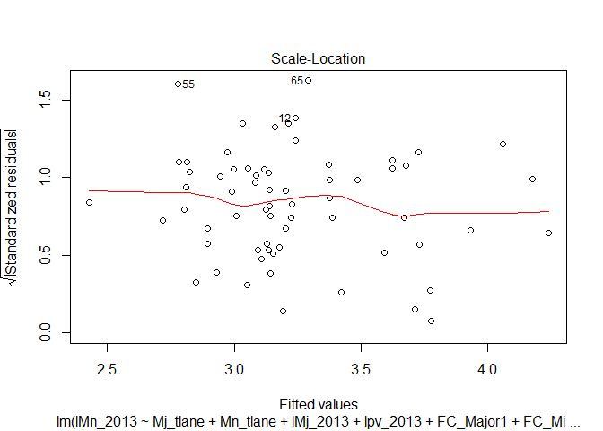
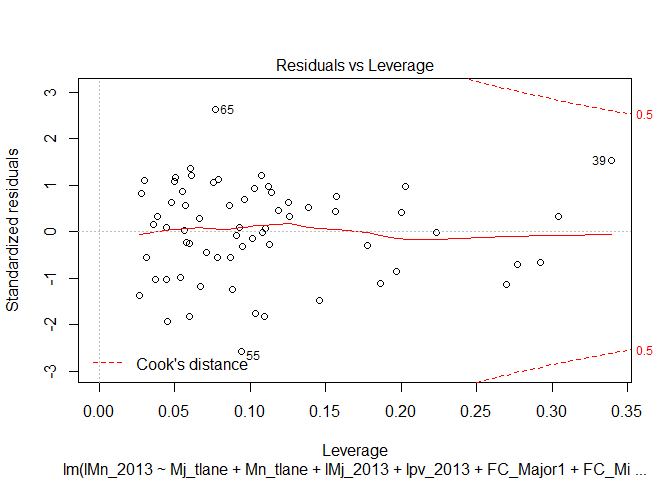

Linear Regression for Traffic Volume
================
MA
April 27, 2018

<style type="text/css">

body{ /* Normal  */
      font-size: 12px;
  }
td {  /* Table  */
  font-size: 8px;
}
h1.title {
  font-size: 14px;
  color: DarkRed;
}
h1 { /* Header 1 */
  font-size: 16px;
  color: DarkBlue;
}
h2 { /* Header 2 */
    font-size: 18px;
  color: DarkBlue;
}
h3 { /* Header 3 */
  font-size: 22px;
  font-family: "Times New Roman", Times, serif;
  color: DarkBlue;
}
code.r{ /* Code block */
    font-size: 12px;
}
pre { /* Code block - determines code spacing between lines */
    font-size: 14px;
}
</style>
Introduction
------------

This is one of my course projects finished at PSU. The project attempts to explore a multiple linear regression model to estimate average annual daily traffic (AADT) of minor roads at signalized intersections in Colorado. Due to the privacy, I will not display the dataset and just show the general process that how I built the multiple linear regression to estimate the traffic volume.

65 signalized intersections were selected as samples and 22 potential variables, including Major Rodad Traffice Volume, number of Total Traffice Leanes on Major road, Speed Limit on Major Road, County Population, City Median Income and so on, were collected for building the model.

Data Collection
---------------

Read and get the data ready in R

``` r
LIM<-read.csv('C:\\G\\desk\\STAT 564\\project\\LIM.csv',header=TRUE,sep=",")
mydata<-cbind(LIM[,7:36])
mydata<-mydata[-31,]
colnames(mydata)<-paste("m2017.",names(mydata),sep ='')
colnames(mydata)[9]<-"m2017.PV"
colnames(mydata)[26]<-"m2017.lMj"
colnames(mydata)[27]<-"m2017.lMn"
colnames(mydata)[28]<-"m2017.lpv"
```

Model building
--------------

correlation
===========

``` r
cor(mydata[,1:13])
```

    ##                                m2017.County.Pop
    ## m2017.County.Pop                     1.00000000
    ## m2017.County.Per.capita.Income       0.63695334
    ## m2017.County.Med.Inc                 0.50547471
    ## m2017.City.Pop                       0.47904947
    ## m2017.City.Per.Capita.Inc            0.30364100
    ## m2017.City.Med.Income                0.33344388
    ## m2017.Net_Den                        0.19440681
    ## m2017.Int_Den                        0.22597906
    ## m2017.PV                             0.23182624
    ## m2017.Mj_tlane                      -0.12239793
    ## m2017.Mn_tlane                       0.08385886
    ## m2017.Mj_speed                       0.22088587
    ## m2017.Mj_roadwidth                  -0.03106351
    ##                                m2017.County.Per.capita.Income
    ## m2017.County.Pop                                   0.63695334
    ## m2017.County.Per.capita.Income                     1.00000000
    ## m2017.County.Med.Inc                               0.83836903
    ## m2017.City.Pop                                     0.08731593
    ## m2017.City.Per.Capita.Inc                          0.64697237
    ## m2017.City.Med.Income                              0.65018060
    ## m2017.Net_Den                                      0.15867340
    ## m2017.Int_Den                                      0.14182193
    ## m2017.PV                                           0.11067354
    ## m2017.Mj_tlane                                    -0.08578786
    ## m2017.Mn_tlane                                    -0.04443747
    ## m2017.Mj_speed                                     0.19837391
    ## m2017.Mj_roadwidth                                 0.06544798
    ##                                m2017.County.Med.Inc m2017.City.Pop
    ## m2017.County.Pop                         0.50547471     0.47904947
    ## m2017.County.Per.capita.Income           0.83836903     0.08731593
    ## m2017.County.Med.Inc                     1.00000000    -0.05194310
    ## m2017.City.Pop                          -0.05194310     1.00000000
    ## m2017.City.Per.Capita.Inc                0.56676811     0.19268269
    ## m2017.City.Med.Income                    0.78991920    -0.07923190
    ## m2017.Net_Den                            0.07459553     0.11249903
    ## m2017.Int_Den                            0.06528749     0.05509288
    ## m2017.PV                                 0.04009689     0.39481025
    ## m2017.Mj_tlane                          -0.11137310    -0.12767831
    ## m2017.Mn_tlane                          -0.16876249     0.09922354
    ## m2017.Mj_speed                           0.25395718     0.20353964
    ## m2017.Mj_roadwidth                       0.13304682    -0.15162043
    ##                                m2017.City.Per.Capita.Inc
    ## m2017.County.Pop                              0.30364100
    ## m2017.County.Per.capita.Income                0.64697237
    ## m2017.County.Med.Inc                          0.56676811
    ## m2017.City.Pop                                0.19268269
    ## m2017.City.Per.Capita.Inc                     1.00000000
    ## m2017.City.Med.Income                         0.75549181
    ## m2017.Net_Den                                 0.08166488
    ## m2017.Int_Den                                -0.01546342
    ## m2017.PV                                      0.16557900
    ## m2017.Mj_tlane                               -0.07613079
    ## m2017.Mn_tlane                                0.06769739
    ## m2017.Mj_speed                                0.16449006
    ## m2017.Mj_roadwidth                            0.03939576
    ##                                m2017.City.Med.Income m2017.Net_Den
    ## m2017.County.Pop                          0.33344388    0.19440681
    ## m2017.County.Per.capita.Income            0.65018060    0.15867340
    ## m2017.County.Med.Inc                      0.78991920    0.07459553
    ## m2017.City.Pop                           -0.07923190    0.11249903
    ## m2017.City.Per.Capita.Inc                 0.75549181    0.08166488
    ## m2017.City.Med.Income                     1.00000000    0.01650622
    ## m2017.Net_Den                             0.01650622    1.00000000
    ## m2017.Int_Den                            -0.01832571    0.91879984
    ## m2017.PV                                  0.09399071    0.04622438
    ## m2017.Mj_tlane                           -0.04099004   -0.08070787
    ## m2017.Mn_tlane                           -0.02768692    0.20653559
    ## m2017.Mj_speed                            0.17059099   -0.52923675
    ## m2017.Mj_roadwidth                        0.15251533   -0.38856578
    ##                                m2017.Int_Den    m2017.PV m2017.Mj_tlane
    ## m2017.County.Pop                  0.22597906  0.23182624    -0.12239793
    ## m2017.County.Per.capita.Income    0.14182193  0.11067354    -0.08578786
    ## m2017.County.Med.Inc              0.06528749  0.04009689    -0.11137310
    ## m2017.City.Pop                    0.05509288  0.39481025    -0.12767831
    ## m2017.City.Per.Capita.Inc        -0.01546342  0.16557900    -0.07613079
    ## m2017.City.Med.Income            -0.01832571  0.09399071    -0.04099004
    ## m2017.Net_Den                     0.91879984  0.04622438    -0.08070787
    ## m2017.Int_Den                     1.00000000 -0.07537223    -0.12343554
    ## m2017.PV                         -0.07537223  1.00000000    -0.17553970
    ## m2017.Mj_tlane                   -0.12343554 -0.17553970     1.00000000
    ## m2017.Mn_tlane                    0.09936779  0.25055617     0.09360120
    ## m2017.Mj_speed                   -0.41922756 -0.06032819     0.07787233
    ## m2017.Mj_roadwidth               -0.34334277 -0.02320065     0.44793323
    ##                                m2017.Mn_tlane m2017.Mj_speed
    ## m2017.County.Pop                   0.08385886     0.22088587
    ## m2017.County.Per.capita.Income    -0.04443747     0.19837391
    ## m2017.County.Med.Inc              -0.16876249     0.25395718
    ## m2017.City.Pop                     0.09922354     0.20353964
    ## m2017.City.Per.Capita.Inc          0.06769739     0.16449006
    ## m2017.City.Med.Income             -0.02768692     0.17059099
    ## m2017.Net_Den                      0.20653559    -0.52923675
    ## m2017.Int_Den                      0.09936779    -0.41922756
    ## m2017.PV                           0.25055617    -0.06032819
    ## m2017.Mj_tlane                     0.09360120     0.07787233
    ## m2017.Mn_tlane                     1.00000000    -0.26898228
    ## m2017.Mj_speed                    -0.26898228     1.00000000
    ## m2017.Mj_roadwidth                -0.15959567     0.42165153
    ##                                m2017.Mj_roadwidth
    ## m2017.County.Pop                      -0.03106351
    ## m2017.County.Per.capita.Income         0.06544798
    ## m2017.County.Med.Inc                   0.13304682
    ## m2017.City.Pop                        -0.15162043
    ## m2017.City.Per.Capita.Inc              0.03939576
    ## m2017.City.Med.Income                  0.15251533
    ## m2017.Net_Den                         -0.38856578
    ## m2017.Int_Den                         -0.34334277
    ## m2017.PV                              -0.02320065
    ## m2017.Mj_tlane                         0.44793323
    ## m2017.Mn_tlane                        -0.15959567
    ## m2017.Mj_speed                         0.42165153
    ## m2017.Mj_roadwidth                     1.00000000

The matrix reveals there are high correlation between “2017.County. Per. Capital .Income” and “2017.County Med. Income”(r=0.8384), “2017.Net\_Den” and “2017.Int\_Den”(r=0.9188). Since they are highly relevant, only “2017.County. Per. Capital .Income” and “2017.Net\_Den” would be introduced into the model “2017.County Med. Income” and “2017.Int\_Den” were not considered in this case.

Transformation
==============

In most transportation researches, average annual daily traffic data would be transformed to log(average annual daily traffic) especially in linear models. In most cases, average annual daily traffic data would violate the assumption of normal distribution assumption and thus, effect the model building and diagnose. Using average annual daily traffic data of major roads for example, Figure 1 shows that the original data do suffer the problem of violation to normal distribution and transformation solve this problem well. Thus, all average annual daily traffic data, including on major road, minor road and paralleled road, are transformed to log format.

``` r
par(mfrow=c(1,2))
qqnorm(y=mydata[,"m2017.lMn"])
qqline(y=mydata[,"m2017.lMn"])
qqnorm(y=log(mydata[,"m2017.lMn"]))
qqline(y=log(mydata[,"m2017.lMn"]))
```



Variable selection and model building
=====================================

All regression analysis is impractical and inefficient because 222-1 models need to be analyzed by this method. Therefore, Forward Selection, Backward Elimination and Stepwise regression by the Akaike Information Criterion (AIC) were performed first, and all regression analysis, based on all variables mentioned by the results of three methods performed before, were used to search any other possible models.

Forward Selection
=================

The Forward Selection starts with only intercept in the model and ends with all regressors who meet the criteria entered the model. Each step, only the regressor with lowest AIC could be introduced to the model.

``` r
model<-LIM[-31,c(7,8,10,11:13,15:36)]
model<-model[,-c(20:23)]
start<-lm(lMn_2013~1,data=model)
summary(start)
```

    ## 
    ## Call:
    ## lm(formula = lMn_2013 ~ 1, data = model)
    ## 
    ## Residuals:
    ##      Min       1Q   Median       3Q      Max 
    ## -0.93636 -0.25990 -0.04987  0.19801  1.11091 
    ## 
    ## Coefficients:
    ##             Estimate Std. Error t value Pr(>|t|)    
    ## (Intercept)  3.23739    0.05074    63.8   <2e-16 ***
    ## ---
    ## Signif. codes:  0 '***' 0.001 '**' 0.01 '*' 0.05 '.' 0.1 ' ' 1
    ## 
    ## Residual standard error: 0.4091 on 64 degrees of freedom

``` r
full<-lm(lMn_2013~.,data=model)
summary(full)
```

    ## 
    ## Call:
    ## lm(formula = lMn_2013 ~ ., data = model)
    ## 
    ## Residuals:
    ##      Min       1Q   Median       3Q      Max 
    ## -0.39435 -0.11216  0.01147  0.13874  0.36295 
    ## 
    ## Coefficients:
    ##                            Estimate Std. Error t value Pr(>|t|)    
    ## (Intercept)              -4.589e-01  1.077e+00  -0.426 0.672120    
    ## County.Pop                1.282e-07  2.584e-07   0.496 0.622515    
    ## County.Per.capita.Income  4.973e-07  1.294e-05   0.038 0.969519    
    ## City.Pop                 -6.123e-07  5.230e-07  -1.171 0.248507    
    ## City.Per.Capita.Inc       1.545e-05  1.182e-05   1.307 0.198482    
    ## City.Med.Income          -6.633e-06  4.300e-06  -1.543 0.130621    
    ## Net_Den                   7.538e-03  6.529e-03   1.155 0.254941    
    ## PV_2013                  -3.834e-06  2.097e-05  -0.183 0.855867    
    ## Mj_tlane                 -2.340e-01  7.393e-02  -3.166 0.002915 ** 
    ## Mn_tlane                  3.706e-01  6.940e-02   5.341 3.73e-06 ***
    ## Mj_speed                 -4.787e-03  6.983e-03  -0.685 0.496892    
    ## Mj_roadwidth              2.662e-03  3.073e-03   0.866 0.391312    
    ## Mj_eleft                 -1.517e-02  1.077e-01  -0.141 0.888718    
    ## Mj_eright                 2.553e-02  7.416e-02   0.344 0.732383    
    ## Mj_TWLTL                  3.071e-02  8.509e-02   0.361 0.719990    
    ## Mn_speed                  1.101e-02  6.989e-03   1.575 0.122840    
    ## Mn_roadwidth             -1.826e-03  4.197e-03  -0.435 0.665675    
    ## Mn_eleft                  8.443e-05  7.452e-02   0.001 0.999102    
    ## Mn_eright                 3.424e-02  7.404e-02   0.462 0.646196    
    ## Mn_TWLTL                 -1.062e-01  8.674e-02  -1.224 0.227791    
    ## lMj_2013                  6.775e-01  1.885e-01   3.595 0.000862 ***
    ## lpv_2013                  1.912e-01  2.771e-01   0.690 0.494109    
    ## FC_Major1Collector        2.389e-01  1.337e-01   1.787 0.081336 .  
    ## FC_Minor1Collector       -2.258e-01  7.654e-02  -2.950 0.005225 ** 
    ## ---
    ## Signif. codes:  0 '***' 0.001 '**' 0.01 '*' 0.05 '.' 0.1 ' ' 1
    ## 
    ## Residual standard error: 0.2107 on 41 degrees of freedom
    ## Multiple R-squared:  0.8301, Adjusted R-squared:  0.7349 
    ## F-statistic: 8.712 on 23 and 41 DF,  p-value: 1.613e-09

``` r
modelf<-step(start, scope=list(lower=start, upper=full), direction="forward")
```

    ## Start:  AIC=-115.2
    ## lMn_2013 ~ 1
    ## 
    ##                            Df Sum of Sq     RSS     AIC
    ## + Mn_tlane                  1    5.9947  4.7164 -166.52
    ## + FC_Minor1                 1    3.7584  6.9526 -141.29
    ## + Mn_roadwidth              1    2.4041  8.3069 -129.72
    ## + lpv_2013                  1    2.4004  8.3106 -129.69
    ## + PV_2013                   1    1.9442  8.7668 -126.22
    ## + Mj_TWLTL                  1    1.8038  8.9072 -125.19
    ## + lMj_2013                  1    1.1079  9.6031 -120.30
    ## + Mn_eright                 1    0.9659  9.7451 -119.34
    ## + Mj_roadwidth              1    0.6505 10.0605 -117.28
    ## + Mj_eright                 1    0.6013 10.1097 -116.96
    ## + Mj_speed                  1    0.3528 10.3583 -115.38
    ## + Mj_tlane                  1    0.3347 10.3764 -115.27
    ## <none>                                  10.7110 -115.20
    ## + City.Per.Capita.Inc       1    0.3235 10.3875 -115.20
    ## + Net_Den                   1    0.3185 10.3925 -115.16
    ## + City.Pop                  1    0.3049 10.4061 -115.08
    ## + Mj_eleft                  1    0.3003 10.4107 -115.05
    ## + County.Pop                1    0.2295 10.4815 -114.61
    ## + FC_Major1                 1    0.1643 10.5468 -114.21
    ## + Mn_speed                  1    0.0885 10.6226 -113.74
    ## + County.Per.capita.Income  1    0.0571 10.6539 -113.55
    ## + Mn_eleft                  1    0.0386 10.6725 -113.44
    ## + City.Med.Income           1    0.0202 10.6908 -113.33
    ## + Mn_TWLTL                  1    0.0064 10.7047 -113.24
    ## 
    ## Step:  AIC=-166.52
    ## lMn_2013 ~ Mn_tlane
    ## 
    ##                            Df Sum of Sq    RSS     AIC
    ## + FC_Minor1                 1   0.92555 3.7908 -178.72
    ## + lpv_2013                  1   0.85944 3.8569 -177.59
    ## + Mj_tlane                  1   0.65810 4.0583 -174.29
    ## + PV_2013                   1   0.65064 4.0657 -174.17
    ## + Mj_TWLTL                  1   0.28350 4.4329 -168.55
    ## + Mj_eright                 1   0.26244 4.4539 -168.24
    ## + Mn_speed                  1   0.23606 4.4803 -167.85
    ## + Mn_eright                 1   0.21830 4.4981 -167.60
    ## + FC_Major1                 1   0.17964 4.5367 -167.04
    ## + Mj_roadwidth              1   0.17738 4.5390 -167.01
    ## + Mn_eleft                  1   0.17589 4.5405 -166.99
    ## + lMj_2013                  1   0.16450 4.5519 -166.82
    ## + City.Per.Capita.Inc       1   0.16316 4.5532 -166.81
    ## + Mn_roadwidth              1   0.14824 4.5681 -166.59
    ## <none>                                  4.7164 -166.52
    ## + County.Per.capita.Income  1   0.12115 4.5952 -166.21
    ## + City.Pop                  1   0.09660 4.6198 -165.86
    ## + County.Pop                1   0.07548 4.6409 -165.57
    ## + City.Med.Income           1   0.04412 4.6722 -165.13
    ## + Mj_eleft                  1   0.00685 4.7095 -164.61
    ## + Mn_TWLTL                  1   0.00612 4.7102 -164.60
    ## + Mj_speed                  1   0.00450 4.7119 -164.58
    ## + Net_Den                   1   0.00359 4.7128 -164.57
    ## 
    ## Step:  AIC=-178.72
    ## lMn_2013 ~ Mn_tlane + FC_Minor1
    ## 
    ##                            Df Sum of Sq    RSS     AIC
    ## + lpv_2013                  1   0.60373 3.1871 -187.99
    ## + PV_2013                   1   0.46189 3.3289 -185.16
    ## + Mj_tlane                  1   0.32927 3.4615 -182.62
    ## + lMj_2013                  1   0.31424 3.4766 -182.34
    ## + County.Per.capita.Income  1   0.28695 3.5039 -181.83
    ## + Mj_eright                 1   0.25126 3.5395 -181.18
    ## + Mj_TWLTL                  1   0.23988 3.5509 -180.97
    ## + City.Per.Capita.Inc       1   0.21626 3.5746 -180.54
    ## + County.Pop                1   0.21108 3.5797 -180.44
    ## + City.Med.Income           1   0.14710 3.6437 -179.29
    ## + Mn_eleft                  1   0.13302 3.6578 -179.04
    ## <none>                                  3.7908 -178.72
    ## + FC_Major1                 1   0.11416 3.6766 -178.71
    ## + Mn_roadwidth              1   0.09982 3.6910 -178.45
    ## + Mn_speed                  1   0.07424 3.7166 -178.00
    ## + Mn_eright                 1   0.06908 3.7217 -177.91
    ## + Mn_TWLTL                  1   0.04932 3.7415 -177.57
    ## + Mj_roadwidth              1   0.03611 3.7547 -177.34
    ## + City.Pop                  1   0.03216 3.7586 -177.27
    ## + Net_Den                   1   0.01258 3.7782 -176.93
    ## + Mj_speed                  1   0.00310 3.7877 -176.77
    ## + Mj_eleft                  1   0.00136 3.7895 -176.74
    ## 
    ## Step:  AIC=-187.99
    ## lMn_2013 ~ Mn_tlane + FC_Minor1 + lpv_2013
    ## 
    ##                            Df Sum of Sq    RSS     AIC
    ## + Mj_TWLTL                  1  0.204084 2.9830 -190.29
    ## + lMj_2013                  1  0.194639 2.9924 -190.09
    ## + County.Per.capita.Income  1  0.186131 3.0009 -189.91
    ## + Mj_tlane                  1  0.168299 3.0188 -189.52
    ## + FC_Major1                 1  0.145271 3.0418 -189.03
    ## + City.Per.Capita.Inc       1  0.139293 3.0478 -188.90
    ## <none>                                  3.1871 -187.99
    ## + Mj_eright                 1  0.085376 3.1017 -187.76
    ## + Mn_eleft                  1  0.083380 3.1037 -187.72
    ## + County.Pop                1  0.082603 3.1045 -187.70
    ## + City.Med.Income           1  0.072576 3.1145 -187.49
    ## + Mn_roadwidth              1  0.043786 3.1433 -186.89
    ## + Mn_TWLTL                  1  0.036786 3.1503 -186.75
    ## + Mn_speed                  1  0.022375 3.1647 -186.45
    ## + Mj_roadwidth              1  0.021511 3.1656 -186.43
    ## + Net_Den                   1  0.017134 3.1699 -186.34
    ## + Mj_eleft                  1  0.007772 3.1793 -186.15
    ## + Mn_eright                 1  0.007731 3.1793 -186.15
    ## + PV_2013                   1  0.002460 3.1846 -186.04
    ## + City.Pop                  1  0.000493 3.1866 -186.00
    ## + Mj_speed                  1  0.000029 3.1870 -185.99
    ## 
    ## Step:  AIC=-190.29
    ## lMn_2013 ~ Mn_tlane + FC_Minor1 + lpv_2013 + Mj_TWLTL
    ## 
    ##                            Df Sum of Sq    RSS     AIC
    ## + lMj_2013                  1  0.187071 2.7959 -192.50
    ## + FC_Major1                 1  0.158512 2.8245 -191.84
    ## + County.Per.capita.Income  1  0.131913 2.8511 -191.24
    ## <none>                                  2.9830 -190.29
    ## + City.Per.Capita.Inc       1  0.088794 2.8942 -190.26
    ## + Mn_eleft                  1  0.078014 2.9050 -190.02
    ## + Mj_tlane                  1  0.074223 2.9088 -189.93
    ## + Mj_eright                 1  0.065626 2.9174 -189.74
    ## + Mn_eright                 1  0.054315 2.9287 -189.49
    ## + County.Pop                1  0.049739 2.9333 -189.39
    ## + City.Med.Income           1  0.041795 2.9412 -189.21
    ## + Mn_roadwidth              1  0.037157 2.9458 -189.11
    ## + Mn_speed                  1  0.029464 2.9535 -188.94
    ## + Mj_speed                  1  0.015498 2.9675 -188.63
    ## + Mj_eleft                  1  0.011597 2.9714 -188.55
    ## + Mj_roadwidth              1  0.007079 2.9759 -188.45
    ## + PV_2013                   1  0.004685 2.9783 -188.40
    ## + Net_Den                   1  0.002014 2.9810 -188.34
    ## + Mn_TWLTL                  1  0.001179 2.9818 -188.32
    ## + City.Pop                  1  0.000386 2.9826 -188.30
    ## 
    ## Step:  AIC=-192.5
    ## lMn_2013 ~ Mn_tlane + FC_Minor1 + lpv_2013 + Mj_TWLTL + lMj_2013
    ## 
    ##                            Df Sum of Sq    RSS     AIC
    ## + Mj_tlane                  1   0.41839 2.3775 -201.04
    ## + FC_Major1                 1   0.26650 2.5294 -197.02
    ## + County.Per.capita.Income  1   0.08554 2.7104 -192.52
    ## <none>                                  2.7959 -192.50
    ## + City.Per.Capita.Inc       1   0.05589 2.7400 -191.82
    ## + Mj_eright                 1   0.04312 2.7528 -191.51
    ## + Mn_eleft                  1   0.03444 2.7615 -191.31
    ## + County.Pop                1   0.02893 2.7670 -191.18
    ## + Mn_eright                 1   0.02585 2.7701 -191.11
    ## + Mn_speed                  1   0.01789 2.7780 -190.92
    ## + City.Med.Income           1   0.00851 2.7874 -190.70
    ## + Mj_eleft                  1   0.00840 2.7875 -190.70
    ## + Mn_roadwidth              1   0.00681 2.7891 -190.66
    ## + Mj_roadwidth              1   0.00398 2.7919 -190.60
    ## + PV_2013                   1   0.00322 2.7927 -190.58
    ## + City.Pop                  1   0.00155 2.7944 -190.54
    ## + Mj_speed                  1   0.00020 2.7957 -190.51
    ## + Mn_TWLTL                  1   0.00005 2.7959 -190.51
    ## + Net_Den                   1   0.00001 2.7959 -190.50
    ## 
    ## Step:  AIC=-201.04
    ## lMn_2013 ~ Mn_tlane + FC_Minor1 + lpv_2013 + Mj_TWLTL + lMj_2013 + 
    ##     Mj_tlane
    ## 
    ##                            Df Sum of Sq    RSS     AIC
    ## + FC_Major1                 1  0.196294 2.1812 -204.64
    ## <none>                                  2.3775 -201.04
    ## + Mn_TWLTL                  1  0.033137 2.3444 -199.95
    ## + County.Per.capita.Income  1  0.026955 2.3506 -199.78
    ## + City.Per.Capita.Inc       1  0.022965 2.3546 -199.67
    ## + Mn_eright                 1  0.019262 2.3583 -199.57
    ## + Mj_eright                 1  0.019154 2.3584 -199.57
    ## + Mn_speed                  1  0.015716 2.3618 -199.47
    ## + Mj_eleft                  1  0.013008 2.3645 -199.40
    ## + City.Pop                  1  0.011265 2.3663 -199.35
    ## + Mj_speed                  1  0.005016 2.3725 -199.18
    ## + Net_Den                   1  0.002872 2.3747 -199.12
    ## + Mj_roadwidth              1  0.002303 2.3752 -199.10
    ## + City.Med.Income           1  0.001980 2.3756 -199.09
    ## + Mn_roadwidth              1  0.001226 2.3763 -199.07
    ## + County.Pop                1  0.000833 2.3767 -199.06
    ## + Mn_eleft                  1  0.000479 2.3771 -199.05
    ## + PV_2013                   1  0.000318 2.3772 -199.05
    ## 
    ## Step:  AIC=-204.64
    ## lMn_2013 ~ Mn_tlane + FC_Minor1 + lpv_2013 + Mj_TWLTL + lMj_2013 + 
    ##     Mj_tlane + FC_Major1
    ## 
    ##                            Df Sum of Sq    RSS     AIC
    ## <none>                                  2.1812 -204.64
    ## + Mn_TWLTL                  1  0.057780 2.1235 -204.39
    ## + County.Per.capita.Income  1  0.039054 2.1422 -203.82
    ## + City.Per.Capita.Inc       1  0.032226 2.1490 -203.61
    ## + Net_Den                   1  0.025784 2.1555 -203.41
    ## + Mj_eleft                  1  0.007325 2.1739 -202.86
    ## + Mn_eright                 1  0.007085 2.1742 -202.85
    ## + PV_2013                   1  0.006077 2.1752 -202.82
    ## + Mn_speed                  1  0.004996 2.1762 -202.79
    ## + City.Pop                  1  0.004907 2.1763 -202.79
    ## + Mn_eleft                  1  0.003595 2.1776 -202.75
    ## + Mj_roadwidth              1  0.003564 2.1777 -202.75
    ## + Mj_speed                  1  0.001852 2.1794 -202.70
    ## + County.Pop                1  0.001548 2.1797 -202.69
    ## + City.Med.Income           1  0.000973 2.1803 -202.67
    ## + Mn_roadwidth              1  0.000925 2.1803 -202.67
    ## + Mj_eright                 1  0.000342 2.1809 -202.65

``` r
summary(modelf)
```

    ## 
    ## Call:
    ## lm(formula = lMn_2013 ~ Mn_tlane + FC_Minor1 + lpv_2013 + Mj_TWLTL + 
    ##     lMj_2013 + Mj_tlane + FC_Major1, data = model)
    ## 
    ## Residuals:
    ##      Min       1Q   Median       3Q      Max 
    ## -0.47163 -0.13077  0.00823  0.15031  0.48027 
    ## 
    ## Coefficients:
    ##                    Estimate Std. Error t value Pr(>|t|)    
    ## (Intercept)         0.25267    0.52384   0.482 0.631404    
    ## Mn_tlane            0.35636    0.05227   6.817 6.41e-09 ***
    ## FC_Minor1Collector -0.22076    0.05913  -3.733 0.000438 ***
    ## lpv_2013            0.20121    0.09414   2.137 0.036883 *  
    ## Mj_TWLTL           -0.04927    0.05780  -0.852 0.397531    
    ## lMj_2013            0.56374    0.14131   3.989 0.000191 ***
    ## Mj_tlane           -0.16750    0.05553  -3.016 0.003817 ** 
    ## FC_Major1Collector  0.23864    0.10537   2.265 0.027341 *  
    ## ---
    ## Signif. codes:  0 '***' 0.001 '**' 0.01 '*' 0.05 '.' 0.1 ' ' 1
    ## 
    ## Residual standard error: 0.1956 on 57 degrees of freedom
    ## Multiple R-squared:  0.7964, Adjusted R-squared:  0.7713 
    ## F-statistic: 31.84 on 7 and 57 DF,  p-value: < 2.2e-16

``` r
modelf$anova
```

    ##          Step Df  Deviance Resid. Df Resid. Dev       AIC
    ## 1             NA        NA        64  10.711017 -115.2024
    ## 2  + Mn_tlane -1 5.9946588        63   4.716359 -166.5178
    ## 3 + FC_Minor1 -1 0.9255489        62   3.790810 -178.7175
    ## 4  + lpv_2013 -1 0.6037342        61   3.187076 -187.9934
    ## 5  + Mj_TWLTL -1 0.2040840        60   2.982991 -190.2949
    ## 6  + lMj_2013 -1 0.1870708        59   2.795921 -192.5047
    ## 7  + Mj_tlane -1 0.4183896        58   2.377531 -201.0411
    ## 8 + FC_Major1 -1 0.1962943        57   2.181237 -204.6422

Backward Elinimation
====================

The Backward Elimination starts with all regressors in the model and delete a regressor with highest AIC each step until the model reaches the lowest AIC.

``` r
modelb<-step(full,data=model, direction="backward")
```

    ## Start:  AIC=-184.43
    ## lMn_2013 ~ County.Pop + County.Per.capita.Income + City.Pop + 
    ##     City.Per.Capita.Inc + City.Med.Income + Net_Den + PV_2013 + 
    ##     Mj_tlane + Mn_tlane + Mj_speed + Mj_roadwidth + Mj_eleft + 
    ##     Mj_eright + Mj_TWLTL + Mn_speed + Mn_roadwidth + Mn_eleft + 
    ##     Mn_eright + Mn_TWLTL + lMj_2013 + lpv_2013 + FC_Major1 + 
    ##     FC_Minor1
    ## 
    ##                            Df Sum of Sq    RSS     AIC
    ## - Mn_eleft                  1   0.00000 1.8193 -186.43
    ## - County.Per.capita.Income  1   0.00007 1.8194 -186.43
    ## - Mj_eleft                  1   0.00088 1.8202 -186.40
    ## - PV_2013                   1   0.00148 1.8208 -186.38
    ## - Mj_eright                 1   0.00526 1.8246 -186.25
    ## - Mj_TWLTL                  1   0.00578 1.8251 -186.23
    ## - Mn_roadwidth              1   0.00841 1.8277 -186.13
    ## - Mn_eright                 1   0.00949 1.8288 -186.10
    ## - County.Pop                1   0.01092 1.8303 -186.04
    ## - Mj_speed                  1   0.02085 1.8402 -185.69
    ## - lpv_2013                  1   0.02112 1.8405 -185.68
    ## - Mj_roadwidth              1   0.03331 1.8526 -185.25
    ## <none>                                  1.8193 -184.43
    ## - Net_Den                   1   0.05915 1.8785 -184.35
    ## - City.Pop                  1   0.06081 1.8801 -184.30
    ## - Mn_TWLTL                  1   0.06652 1.8859 -184.10
    ## - City.Per.Capita.Inc       1   0.07581 1.8951 -183.78
    ## - City.Med.Income           1   0.10559 1.9249 -182.77
    ## - Mn_speed                  1   0.11014 1.9295 -182.61
    ## - FC_Major1                 1   0.14170 1.9610 -181.56
    ## - FC_Minor1                 1   0.38628 2.2056 -173.92
    ## - Mj_tlane                  1   0.44474 2.2641 -172.22
    ## - lMj_2013                  1   0.57354 2.3929 -168.62
    ## - Mn_tlane                  1   1.26571 3.0850 -152.11
    ## 
    ## Step:  AIC=-186.43
    ## lMn_2013 ~ County.Pop + County.Per.capita.Income + City.Pop + 
    ##     City.Per.Capita.Inc + City.Med.Income + Net_Den + PV_2013 + 
    ##     Mj_tlane + Mn_tlane + Mj_speed + Mj_roadwidth + Mj_eleft + 
    ##     Mj_eright + Mj_TWLTL + Mn_speed + Mn_roadwidth + Mn_eright + 
    ##     Mn_TWLTL + lMj_2013 + lpv_2013 + FC_Major1 + FC_Minor1
    ## 
    ##                            Df Sum of Sq    RSS     AIC
    ## - County.Per.capita.Income  1   0.00007 1.8194 -188.43
    ## - Mj_eleft                  1   0.00105 1.8204 -188.40
    ## - PV_2013                   1   0.00151 1.8209 -188.38
    ## - Mj_eright                 1   0.00570 1.8250 -188.23
    ## - Mj_TWLTL                  1   0.00579 1.8251 -188.23
    ## - Mn_roadwidth              1   0.00841 1.8278 -188.13
    ## - Mn_eright                 1   0.00975 1.8291 -188.09
    ## - County.Pop                1   0.01102 1.8304 -188.04
    ## - Mj_speed                  1   0.02129 1.8406 -187.68
    ## - lpv_2013                  1   0.02167 1.8410 -187.66
    ## - Mj_roadwidth              1   0.03435 1.8537 -187.22
    ## <none>                                  1.8193 -186.43
    ## - Net_Den                   1   0.05925 1.8786 -186.35
    ## - City.Pop                  1   0.06084 1.8802 -186.30
    ## - Mn_TWLTL                  1   0.06663 1.8860 -186.10
    ## - City.Per.Capita.Inc       1   0.07584 1.8952 -185.78
    ## - City.Med.Income           1   0.10596 1.9253 -184.75
    ## - Mn_speed                  1   0.11144 1.9308 -184.57
    ## - FC_Major1                 1   0.14353 1.9629 -183.50
    ## - FC_Minor1                 1   0.38971 2.2091 -175.82
    ## - Mj_tlane                  1   0.45130 2.2706 -174.03
    ## - lMj_2013                  1   0.63669 2.4560 -168.93
    ## - Mn_tlane                  1   1.35046 3.1698 -152.35
    ## 
    ## Step:  AIC=-188.43
    ## lMn_2013 ~ County.Pop + City.Pop + City.Per.Capita.Inc + City.Med.Income + 
    ##     Net_Den + PV_2013 + Mj_tlane + Mn_tlane + Mj_speed + Mj_roadwidth + 
    ##     Mj_eleft + Mj_eright + Mj_TWLTL + Mn_speed + Mn_roadwidth + 
    ##     Mn_eright + Mn_TWLTL + lMj_2013 + lpv_2013 + FC_Major1 + 
    ##     FC_Minor1
    ## 
    ##                       Df Sum of Sq    RSS     AIC
    ## - Mj_eleft             1   0.00119 1.8206 -190.39
    ## - PV_2013              1   0.00148 1.8209 -190.38
    ## - Mj_eright            1   0.00568 1.8251 -190.23
    ## - Mj_TWLTL             1   0.00625 1.8257 -190.21
    ## - Mn_roadwidth         1   0.00855 1.8280 -190.13
    ## - Mn_eright            1   0.01007 1.8295 -190.07
    ## - County.Pop           1   0.02086 1.8403 -189.69
    ## - Mj_speed             1   0.02143 1.8408 -189.67
    ## - lpv_2013             1   0.02162 1.8410 -189.66
    ## - Mj_roadwidth         1   0.03454 1.8539 -189.21
    ## <none>                             1.8194 -188.43
    ## - Net_Den              1   0.06045 1.8799 -188.31
    ## - Mn_TWLTL             1   0.06726 1.8867 -188.07
    ## - City.Pop             1   0.07542 1.8948 -187.79
    ## - City.Per.Capita.Inc  1   0.09819 1.9176 -187.01
    ## - City.Med.Income      1   0.10608 1.9255 -186.75
    ## - Mn_speed             1   0.11706 1.9365 -186.38
    ## - FC_Major1            1   0.14414 1.9635 -185.48
    ## - FC_Minor1            1   0.39043 2.2098 -177.79
    ## - Mj_tlane             1   0.46684 2.2862 -175.59
    ## - lMj_2013             1   0.64767 2.4671 -170.64
    ## - Mn_tlane             1   1.35459 3.1740 -154.26
    ## 
    ## Step:  AIC=-190.39
    ## lMn_2013 ~ County.Pop + City.Pop + City.Per.Capita.Inc + City.Med.Income + 
    ##     Net_Den + PV_2013 + Mj_tlane + Mn_tlane + Mj_speed + Mj_roadwidth + 
    ##     Mj_eright + Mj_TWLTL + Mn_speed + Mn_roadwidth + Mn_eright + 
    ##     Mn_TWLTL + lMj_2013 + lpv_2013 + FC_Major1 + FC_Minor1
    ## 
    ##                       Df Sum of Sq    RSS     AIC
    ## - PV_2013              1   0.00121 1.8218 -192.35
    ## - Mj_TWLTL             1   0.00528 1.8259 -192.20
    ## - Mj_eright            1   0.00588 1.8265 -192.18
    ## - Mn_roadwidth         1   0.00973 1.8303 -192.04
    ## - Mn_eright            1   0.00987 1.8305 -192.04
    ## - County.Pop           1   0.02039 1.8410 -191.66
    ## - lpv_2013             1   0.02071 1.8413 -191.65
    ## - Mj_speed             1   0.02171 1.8423 -191.62
    ## - Mj_roadwidth         1   0.03340 1.8540 -191.21
    ## <none>                             1.8206 -190.39
    ## - Mn_TWLTL             1   0.06681 1.8874 -190.05
    ## - Net_Den              1   0.07432 1.8949 -189.79
    ## - City.Pop             1   0.07669 1.8973 -189.71
    ## - City.Per.Capita.Inc  1   0.09842 1.9190 -188.97
    ## - City.Med.Income      1   0.10634 1.9269 -188.70
    ## - Mn_speed             1   0.11648 1.9371 -188.36
    ## - FC_Major1            1   0.15435 1.9750 -187.10
    ## - FC_Minor1            1   0.41765 2.2383 -178.97
    ## - Mj_tlane             1   0.50321 2.3238 -176.53
    ## - lMj_2013             1   0.64702 2.4676 -172.62
    ## - Mn_tlane             1   1.35414 3.1747 -156.25
    ## 
    ## Step:  AIC=-192.35
    ## lMn_2013 ~ County.Pop + City.Pop + City.Per.Capita.Inc + City.Med.Income + 
    ##     Net_Den + Mj_tlane + Mn_tlane + Mj_speed + Mj_roadwidth + 
    ##     Mj_eright + Mj_TWLTL + Mn_speed + Mn_roadwidth + Mn_eright + 
    ##     Mn_TWLTL + lMj_2013 + lpv_2013 + FC_Major1 + FC_Minor1
    ## 
    ##                       Df Sum of Sq    RSS     AIC
    ## - Mj_TWLTL             1   0.00569 1.8275 -194.14
    ## - Mj_eright            1   0.00577 1.8276 -194.14
    ## - Mn_eright            1   0.01044 1.8323 -193.97
    ## - Mn_roadwidth         1   0.01158 1.8334 -193.93
    ## - County.Pop           1   0.02060 1.8424 -193.62
    ## - Mj_speed             1   0.02145 1.8433 -193.59
    ## - Mj_roadwidth         1   0.03383 1.8556 -193.15
    ## <none>                             1.8218 -192.35
    ## - lpv_2013             1   0.06357 1.8854 -192.12
    ## - Mn_TWLTL             1   0.06930 1.8911 -191.92
    ## - Net_Den              1   0.07321 1.8950 -191.78
    ## - City.Pop             1   0.09341 1.9152 -191.10
    ## - City.Per.Capita.Inc  1   0.09780 1.9196 -190.95
    ## - City.Med.Income      1   0.10521 1.9270 -190.70
    ## - Mn_speed             1   0.11528 1.9371 -190.36
    ## - FC_Major1            1   0.15781 1.9796 -188.95
    ## - FC_Minor1            1   0.41677 2.2386 -180.96
    ## - Mj_tlane             1   0.50207 2.3239 -178.53
    ## - lMj_2013             1   0.68248 2.5043 -173.66
    ## - Mn_tlane             1   1.35385 3.1757 -158.23
    ## 
    ## Step:  AIC=-194.14
    ## lMn_2013 ~ County.Pop + City.Pop + City.Per.Capita.Inc + City.Med.Income + 
    ##     Net_Den + Mj_tlane + Mn_tlane + Mj_speed + Mj_roadwidth + 
    ##     Mj_eright + Mn_speed + Mn_roadwidth + Mn_eright + Mn_TWLTL + 
    ##     lMj_2013 + lpv_2013 + FC_Major1 + FC_Minor1
    ## 
    ##                       Df Sum of Sq    RSS     AIC
    ## - Mj_eright            1   0.00498 1.8325 -195.97
    ## - Mn_eright            1   0.01244 1.8399 -195.70
    ## - Mn_roadwidth         1   0.01268 1.8402 -195.69
    ## - County.Pop           1   0.01877 1.8463 -195.48
    ## - Mj_speed             1   0.01960 1.8471 -195.45
    ## - Mj_roadwidth         1   0.04085 1.8684 -194.71
    ## <none>                             1.8275 -194.14
    ## - Mn_TWLTL             1   0.06375 1.8913 -193.91
    ## - Net_Den              1   0.06769 1.8952 -193.78
    ## - lpv_2013             1   0.07073 1.8982 -193.68
    ## - City.Pop             1   0.08824 1.9157 -193.08
    ## - City.Per.Capita.Inc  1   0.09394 1.9214 -192.88
    ## - City.Med.Income      1   0.10158 1.9291 -192.63
    ## - Mn_speed             1   0.10961 1.9371 -192.36
    ## - FC_Major1            1   0.15946 1.9870 -190.71
    ## - FC_Minor1            1   0.41556 2.2431 -182.82
    ## - Mj_tlane             1   0.53631 2.3638 -179.42
    ## - lMj_2013             1   0.70880 2.5363 -174.84
    ## - Mn_tlane             1   1.39126 3.2188 -159.35
    ## 
    ## Step:  AIC=-195.97
    ## lMn_2013 ~ County.Pop + City.Pop + City.Per.Capita.Inc + City.Med.Income + 
    ##     Net_Den + Mj_tlane + Mn_tlane + Mj_speed + Mj_roadwidth + 
    ##     Mn_speed + Mn_roadwidth + Mn_eright + Mn_TWLTL + lMj_2013 + 
    ##     lpv_2013 + FC_Major1 + FC_Minor1
    ## 
    ##                       Df Sum of Sq    RSS     AIC
    ## - Mn_roadwidth         1   0.00933 1.8418 -197.64
    ## - Mn_eright            1   0.01080 1.8433 -197.58
    ## - Mj_speed             1   0.01655 1.8490 -197.38
    ## - County.Pop           1   0.02157 1.8541 -197.21
    ## - Mj_roadwidth         1   0.03831 1.8708 -196.62
    ## <none>                             1.8325 -195.97
    ## - Net_Den              1   0.06318 1.8957 -195.76
    ## - Mn_TWLTL             1   0.07266 1.9051 -195.44
    ## - lpv_2013             1   0.08476 1.9172 -195.03
    ## - City.Pop             1   0.08605 1.9185 -194.98
    ## - City.Per.Capita.Inc  1   0.09624 1.9287 -194.64
    ## - City.Med.Income      1   0.09869 1.9312 -194.56
    ## - Mn_speed             1   0.10595 1.9384 -194.31
    ## - FC_Major1            1   0.18987 2.0224 -191.56
    ## - FC_Minor1            1   0.41353 2.2460 -184.74
    ## - Mj_tlane             1   0.53455 2.3670 -181.33
    ## - lMj_2013             1   0.70779 2.5403 -176.74
    ## - Mn_tlane             1   1.39158 3.2241 -161.24
    ## 
    ## Step:  AIC=-197.64
    ## lMn_2013 ~ County.Pop + City.Pop + City.Per.Capita.Inc + City.Med.Income + 
    ##     Net_Den + Mj_tlane + Mn_tlane + Mj_speed + Mj_roadwidth + 
    ##     Mn_speed + Mn_eright + Mn_TWLTL + lMj_2013 + lpv_2013 + FC_Major1 + 
    ##     FC_Minor1
    ## 
    ##                       Df Sum of Sq    RSS     AIC
    ## - Mn_eright            1   0.00770 1.8495 -199.37
    ## - Mj_speed             1   0.01189 1.8537 -199.22
    ## - County.Pop           1   0.02354 1.8654 -198.81
    ## - Mj_roadwidth         1   0.03082 1.8726 -198.56
    ## <none>                             1.8418 -197.64
    ## - Net_Den              1   0.05872 1.9005 -197.60
    ## - Mn_TWLTL             1   0.07149 1.9133 -197.16
    ## - City.Pop             1   0.09037 1.9322 -196.52
    ## - lpv_2013             1   0.09116 1.9330 -196.50
    ## - Mn_speed             1   0.09776 1.9396 -196.28
    ## - City.Per.Capita.Inc  1   0.10389 1.9457 -196.07
    ## - City.Med.Income      1   0.12171 1.9635 -195.48
    ## - FC_Major1            1   0.18408 2.0259 -193.44
    ## - FC_Minor1            1   0.40620 2.2480 -186.68
    ## - Mj_tlane             1   0.52533 2.3671 -183.33
    ## - lMj_2013             1   0.70434 2.5461 -178.59
    ## - Mn_tlane             1   1.55953 3.4013 -159.76
    ## 
    ## Step:  AIC=-199.37
    ## lMn_2013 ~ County.Pop + City.Pop + City.Per.Capita.Inc + City.Med.Income + 
    ##     Net_Den + Mj_tlane + Mn_tlane + Mj_speed + Mj_roadwidth + 
    ##     Mn_speed + Mn_TWLTL + lMj_2013 + lpv_2013 + FC_Major1 + FC_Minor1
    ## 
    ##                       Df Sum of Sq    RSS     AIC
    ## - Mj_speed             1   0.00789 1.8574 -201.09
    ## - County.Pop           1   0.02115 1.8707 -200.63
    ## - Mj_roadwidth         1   0.03781 1.8873 -200.05
    ## - Net_Den              1   0.05649 1.9060 -199.41
    ## <none>                             1.8495 -199.37
    ## - Mn_TWLTL             1   0.07329 1.9228 -198.84
    ## - City.Pop             1   0.08560 1.9351 -198.43
    ## - Mn_speed             1   0.09025 1.9398 -198.27
    ## - City.Per.Capita.Inc  1   0.11252 1.9620 -197.53
    ## - lpv_2013             1   0.11791 1.9674 -197.35
    ## - City.Med.Income      1   0.12746 1.9770 -197.03
    ## - FC_Major1            1   0.20906 2.0586 -194.41
    ## - FC_Minor1            1   0.44554 2.2951 -187.34
    ## - Mj_tlane             1   0.52302 2.3725 -185.18
    ## - lMj_2013             1   0.71672 2.5662 -180.08
    ## - Mn_tlane             1   1.61404 3.4635 -160.59
    ## 
    ## Step:  AIC=-201.09
    ## lMn_2013 ~ County.Pop + City.Pop + City.Per.Capita.Inc + City.Med.Income + 
    ##     Net_Den + Mj_tlane + Mn_tlane + Mj_roadwidth + Mn_speed + 
    ##     Mn_TWLTL + lMj_2013 + lpv_2013 + FC_Major1 + FC_Minor1
    ## 
    ##                       Df Sum of Sq    RSS     AIC
    ## - County.Pop           1   0.01621 1.8736 -202.52
    ## - Mj_roadwidth         1   0.03028 1.8877 -202.04
    ## <none>                             1.8574 -201.09
    ## - Net_Den              1   0.07741 1.9348 -200.44
    ## - Mn_TWLTL             1   0.07870 1.9361 -200.39
    ## - Mn_speed             1   0.08481 1.9422 -200.19
    ## - City.Pop             1   0.09287 1.9503 -199.92
    ## - City.Per.Capita.Inc  1   0.10918 1.9666 -199.38
    ## - City.Med.Income      1   0.12664 1.9840 -198.80
    ## - lpv_2013             1   0.15484 2.0122 -197.88
    ## - FC_Major1            1   0.23970 2.0971 -195.20
    ## - FC_Minor1            1   0.44152 2.2989 -189.23
    ## - Mj_tlane             1   0.51581 2.3732 -187.16
    ## - lMj_2013             1   0.70900 2.5664 -182.07
    ## - Mn_tlane             1   1.80387 3.6613 -158.98
    ## 
    ## Step:  AIC=-202.52
    ## lMn_2013 ~ City.Pop + City.Per.Capita.Inc + City.Med.Income + 
    ##     Net_Den + Mj_tlane + Mn_tlane + Mj_roadwidth + Mn_speed + 
    ##     Mn_TWLTL + lMj_2013 + lpv_2013 + FC_Major1 + FC_Minor1
    ## 
    ##                       Df Sum of Sq    RSS     AIC
    ## - Mj_roadwidth         1   0.03244 1.9060 -203.41
    ## <none>                             1.8736 -202.52
    ## - Mn_TWLTL             1   0.07065 1.9443 -202.12
    ## - City.Pop             1   0.07701 1.9506 -201.91
    ## - Mn_speed             1   0.09723 1.9708 -201.24
    ## - City.Per.Capita.Inc  1   0.10023 1.9738 -201.14
    ## - Net_Den              1   0.10149 1.9751 -201.09
    ## - City.Med.Income      1   0.11121 1.9848 -200.78
    ## - lpv_2013             1   0.15580 2.0294 -199.33
    ## - FC_Major1            1   0.24623 2.1198 -196.50
    ## - FC_Minor1            1   0.43002 2.3036 -191.09
    ## - Mj_tlane             1   0.55541 2.4290 -187.65
    ## - lMj_2013             1   0.74779 2.6214 -182.69
    ## - Mn_tlane             1   1.87680 3.7504 -159.41
    ## 
    ## Step:  AIC=-203.41
    ## lMn_2013 ~ City.Pop + City.Per.Capita.Inc + City.Med.Income + 
    ##     Net_Den + Mj_tlane + Mn_tlane + Mn_speed + Mn_TWLTL + lMj_2013 + 
    ##     lpv_2013 + FC_Major1 + FC_Minor1
    ## 
    ##                       Df Sum of Sq    RSS     AIC
    ## - Mn_TWLTL             1   0.05133 1.9574 -203.68
    ## <none>                             1.9060 -203.41
    ## - Net_Den              1   0.07296 1.9790 -202.97
    ## - City.Pop             1   0.07725 1.9833 -202.83
    ## - Mn_speed             1   0.07919 1.9852 -202.76
    ## - City.Med.Income      1   0.09940 2.0054 -202.10
    ## - City.Per.Capita.Inc  1   0.10352 2.0096 -201.97
    ## - lpv_2013             1   0.16324 2.0693 -200.07
    ## - FC_Major1            1   0.22988 2.1359 -198.01
    ## - FC_Minor1            1   0.40652 2.3126 -192.84
    ## - Mj_tlane             1   0.53767 2.4437 -189.26
    ## - lMj_2013             1   0.74219 2.6482 -184.03
    ## - Mn_tlane             1   1.84554 3.7516 -161.39
    ## 
    ## Step:  AIC=-203.68
    ## lMn_2013 ~ City.Pop + City.Per.Capita.Inc + City.Med.Income + 
    ##     Net_Den + Mj_tlane + Mn_tlane + Mn_speed + lMj_2013 + lpv_2013 + 
    ##     FC_Major1 + FC_Minor1
    ## 
    ##                       Df Sum of Sq    RSS     AIC
    ## - Mn_speed             1   0.05585 2.0132 -203.85
    ## <none>                             1.9574 -203.68
    ## - Net_Den              1   0.09159 2.0490 -202.71
    ## - City.Pop             1   0.09210 2.0495 -202.69
    ## - City.Med.Income      1   0.11943 2.0768 -201.83
    ## - City.Per.Capita.Inc  1   0.13588 2.0932 -201.32
    ## - lpv_2013             1   0.18828 2.1456 -199.71
    ## - FC_Major1            1   0.21416 2.1715 -198.93
    ## - FC_Minor1            1   0.39107 2.3484 -193.84
    ## - Mj_tlane             1   0.51418 2.4716 -190.52
    ## - lMj_2013             1   0.75967 2.7170 -184.37
    ## - Mn_tlane             1   1.79547 3.7528 -163.37
    ## 
    ## Step:  AIC=-203.85
    ## lMn_2013 ~ City.Pop + City.Per.Capita.Inc + City.Med.Income + 
    ##     Net_Den + Mj_tlane + Mn_tlane + lMj_2013 + lpv_2013 + FC_Major1 + 
    ##     FC_Minor1
    ## 
    ##                       Df Sum of Sq    RSS     AIC
    ## - Net_Den              1   0.04417 2.0574 -204.44
    ## - City.Pop             1   0.05783 2.0710 -204.01
    ## <none>                             2.0132 -203.85
    ## - City.Med.Income      1   0.10062 2.1138 -202.68
    ## - City.Per.Capita.Inc  1   0.13952 2.1527 -201.50
    ## - lpv_2013             1   0.20275 2.2160 -199.62
    ## - FC_Major1            1   0.22361 2.2368 -199.01
    ## - FC_Minor1            1   0.48232 2.4955 -191.89
    ## - Mj_tlane             1   0.49916 2.5124 -191.46
    ## - lMj_2013             1   0.74325 2.7565 -185.43
    ## - Mn_tlane             1   1.74957 3.7628 -165.20
    ## 
    ## Step:  AIC=-204.44
    ## lMn_2013 ~ City.Pop + City.Per.Capita.Inc + City.Med.Income + 
    ##     Mj_tlane + Mn_tlane + lMj_2013 + lpv_2013 + FC_Major1 + FC_Minor1
    ## 
    ##                       Df Sum of Sq    RSS     AIC
    ## - City.Pop             1   0.05043 2.1078 -204.87
    ## <none>                             2.0574 -204.44
    ## - City.Med.Income      1   0.10131 2.1587 -203.32
    ## - City.Per.Capita.Inc  1   0.14415 2.2015 -202.04
    ## - FC_Major1            1   0.18980 2.2472 -200.71
    ## - lpv_2013             1   0.19032 2.2477 -200.69
    ## - FC_Minor1            1   0.46274 2.5201 -193.25
    ## - Mj_tlane             1   0.53536 2.5928 -191.41
    ## - lMj_2013             1   0.72044 2.7778 -186.93
    ## - Mn_tlane             1   2.02064 4.0780 -161.97
    ## 
    ## Step:  AIC=-204.87
    ## lMn_2013 ~ City.Per.Capita.Inc + City.Med.Income + Mj_tlane + 
    ##     Mn_tlane + lMj_2013 + lpv_2013 + FC_Major1 + FC_Minor1
    ## 
    ##                       Df Sum of Sq    RSS     AIC
    ## - City.Med.Income      1   0.06298 2.1708 -204.95
    ## <none>                             2.1078 -204.87
    ## - City.Per.Capita.Inc  1   0.10069 2.2085 -203.84
    ## - lpv_2013             1   0.15754 2.2654 -202.18
    ## - FC_Major1            1   0.20292 2.3107 -200.89
    ## - FC_Minor1            1   0.45457 2.5624 -194.17
    ## - Mj_tlane             1   0.50067 2.6085 -193.01
    ## - lMj_2013             1   0.67802 2.7858 -188.74
    ## - Mn_tlane             1   2.06901 4.1768 -162.41
    ## 
    ## Step:  AIC=-204.95
    ## lMn_2013 ~ City.Per.Capita.Inc + Mj_tlane + Mn_tlane + lMj_2013 + 
    ##     lpv_2013 + FC_Major1 + FC_Minor1
    ## 
    ##                       Df Sum of Sq    RSS     AIC
    ## - City.Per.Capita.Inc  1   0.03825 2.2090 -205.82
    ## <none>                             2.1708 -204.95
    ## - lpv_2013             1   0.15761 2.3284 -202.40
    ## - FC_Major1            1   0.19694 2.3677 -201.31
    ## - Mj_tlane             1   0.45714 2.6279 -194.53
    ## - FC_Minor1            1   0.54677 2.7176 -192.35
    ## - lMj_2013             1   0.61527 2.7861 -190.73
    ## - Mn_tlane             1   2.15020 4.3210 -162.21
    ## 
    ## Step:  AIC=-205.82
    ## lMn_2013 ~ Mj_tlane + Mn_tlane + lMj_2013 + lpv_2013 + FC_Major1 + 
    ##     FC_Minor1
    ## 
    ##             Df Sum of Sq    RSS     AIC
    ## <none>                   2.2090 -205.82
    ## - lpv_2013   1   0.16103 2.3701 -203.25
    ## - FC_Major1  1   0.18584 2.3949 -202.57
    ## - FC_Minor1  1   0.52623 2.7353 -193.93
    ## - Mj_tlane   1   0.53222 2.7413 -193.79
    ## - lMj_2013   1   0.71775 2.9268 -189.53
    ## - Mn_tlane   1   2.18107 4.3901 -163.18

``` r
modelb$anova
```

    ##                          Step Df     Deviance Resid. Df Resid. Dev
    ## 1                             NA           NA        41   1.819343
    ## 2                  - Mn_eleft  1 5.694950e-08        42   1.819343
    ## 3  - County.Per.capita.Income  1 6.622541e-05        43   1.819409
    ## 4                  - Mj_eleft  1 1.193692e-03        44   1.820603
    ## 5                   - PV_2013  1 1.214219e-03        45   1.821817
    ## 6                  - Mj_TWLTL  1 5.688041e-03        46   1.827505
    ## 7                 - Mj_eright  1 4.982137e-03        47   1.832487
    ## 8              - Mn_roadwidth  1 9.325633e-03        48   1.841813
    ## 9                 - Mn_eright  1 7.695466e-03        49   1.849508
    ## 10                 - Mj_speed  1 7.890639e-03        50   1.857399
    ## 11               - County.Pop  1 1.620512e-02        51   1.873604
    ## 12             - Mj_roadwidth  1 3.243655e-02        52   1.906041
    ## 13                 - Mn_TWLTL  1 5.133258e-02        53   1.957373
    ## 14                 - Mn_speed  1 5.584505e-02        54   2.013218
    ## 15                  - Net_Den  1 4.417280e-02        55   2.057391
    ## 16                 - City.Pop  1 5.042759e-02        56   2.107819
    ## 17          - City.Med.Income  1 6.297554e-02        57   2.170794
    ## 18      - City.Per.Capita.Inc  1 3.825041e-02        58   2.209045
    ##          AIC
    ## 1  -184.4343
    ## 2  -186.4343
    ## 3  -188.4319
    ## 4  -190.3893
    ## 5  -192.3459
    ## 6  -194.1433
    ## 7  -195.9664
    ## 8  -197.6364
    ## 9  -199.3654
    ## 10 -201.0887
    ## 11 -202.5240
    ## 12 -203.4083
    ## 13 -203.6810
    ## 14 -203.8524
    ## 15 -204.4417
    ## 16 -204.8677
    ## 17 -204.9541
    ## 18 -205.8188

``` r
summary(modelb)
```

    ## 
    ## Call:
    ## lm(formula = lMn_2013 ~ Mj_tlane + Mn_tlane + lMj_2013 + lpv_2013 + 
    ##     FC_Major1 + FC_Minor1, data = model)
    ## 
    ## Residuals:
    ##      Min       1Q   Median       3Q      Max 
    ## -0.47731 -0.10878  0.01747  0.13479  0.49390 
    ## 
    ## Coefficients:
    ##                    Estimate Std. Error t value Pr(>|t|)    
    ## (Intercept)         0.16785    0.51308   0.327 0.744744    
    ## Mj_tlane           -0.18757    0.05018  -3.738 0.000426 ***
    ## Mn_tlane            0.37142    0.04908   7.567 3.26e-10 ***
    ## lMj_2013            0.59329    0.13667   4.341 5.76e-05 ***
    ## lpv_2013            0.19179    0.09327   2.056 0.044270 *  
    ## FC_Major1Collector  0.23146    0.10478   2.209 0.031143 *  
    ## FC_Minor1Collector -0.21917    0.05896  -3.717 0.000456 ***
    ## ---
    ## Signif. codes:  0 '***' 0.001 '**' 0.01 '*' 0.05 '.' 0.1 ' ' 1
    ## 
    ## Residual standard error: 0.1952 on 58 degrees of freedom
    ## Multiple R-squared:  0.7938, Adjusted R-squared:  0.7724 
    ## F-statistic:  37.2 on 6 and 58 DF,  p-value: < 2.2e-16

Stepwise Regression
===================

``` r
modelstep<-step(start, scope = list(upper=full), direction="both")
```

    ## Start:  AIC=-115.2
    ## lMn_2013 ~ 1
    ## 
    ##                            Df Sum of Sq     RSS     AIC
    ## + Mn_tlane                  1    5.9947  4.7164 -166.52
    ## + FC_Minor1                 1    3.7584  6.9526 -141.29
    ## + Mn_roadwidth              1    2.4041  8.3069 -129.72
    ## + lpv_2013                  1    2.4004  8.3106 -129.69
    ## + PV_2013                   1    1.9442  8.7668 -126.22
    ## + Mj_TWLTL                  1    1.8038  8.9072 -125.19
    ## + lMj_2013                  1    1.1079  9.6031 -120.30
    ## + Mn_eright                 1    0.9659  9.7451 -119.34
    ## + Mj_roadwidth              1    0.6505 10.0605 -117.28
    ## + Mj_eright                 1    0.6013 10.1097 -116.96
    ## + Mj_speed                  1    0.3528 10.3583 -115.38
    ## + Mj_tlane                  1    0.3347 10.3764 -115.27
    ## <none>                                  10.7110 -115.20
    ## + City.Per.Capita.Inc       1    0.3235 10.3875 -115.20
    ## + Net_Den                   1    0.3185 10.3925 -115.16
    ## + City.Pop                  1    0.3049 10.4061 -115.08
    ## + Mj_eleft                  1    0.3003 10.4107 -115.05
    ## + County.Pop                1    0.2295 10.4815 -114.61
    ## + FC_Major1                 1    0.1643 10.5468 -114.21
    ## + Mn_speed                  1    0.0885 10.6226 -113.74
    ## + County.Per.capita.Income  1    0.0571 10.6539 -113.55
    ## + Mn_eleft                  1    0.0386 10.6725 -113.44
    ## + City.Med.Income           1    0.0202 10.6908 -113.33
    ## + Mn_TWLTL                  1    0.0064 10.7047 -113.24
    ## 
    ## Step:  AIC=-166.52
    ## lMn_2013 ~ Mn_tlane
    ## 
    ##                            Df Sum of Sq     RSS     AIC
    ## + FC_Minor1                 1    0.9255  3.7908 -178.72
    ## + lpv_2013                  1    0.8594  3.8569 -177.59
    ## + Mj_tlane                  1    0.6581  4.0583 -174.29
    ## + PV_2013                   1    0.6506  4.0657 -174.17
    ## + Mj_TWLTL                  1    0.2835  4.4329 -168.55
    ## + Mj_eright                 1    0.2624  4.4539 -168.24
    ## + Mn_speed                  1    0.2361  4.4803 -167.85
    ## + Mn_eright                 1    0.2183  4.4981 -167.60
    ## + FC_Major1                 1    0.1796  4.5367 -167.04
    ## + Mj_roadwidth              1    0.1774  4.5390 -167.01
    ## + Mn_eleft                  1    0.1759  4.5405 -166.99
    ## + lMj_2013                  1    0.1645  4.5519 -166.82
    ## + City.Per.Capita.Inc       1    0.1632  4.5532 -166.81
    ## + Mn_roadwidth              1    0.1482  4.5681 -166.59
    ## <none>                                   4.7164 -166.52
    ## + County.Per.capita.Income  1    0.1212  4.5952 -166.21
    ## + City.Pop                  1    0.0966  4.6198 -165.86
    ## + County.Pop                1    0.0755  4.6409 -165.57
    ## + City.Med.Income           1    0.0441  4.6722 -165.13
    ## + Mj_eleft                  1    0.0068  4.7095 -164.61
    ## + Mn_TWLTL                  1    0.0061  4.7102 -164.60
    ## + Mj_speed                  1    0.0045  4.7119 -164.58
    ## + Net_Den                   1    0.0036  4.7128 -164.57
    ## - Mn_tlane                  1    5.9947 10.7110 -115.20
    ## 
    ## Step:  AIC=-178.72
    ## lMn_2013 ~ Mn_tlane + FC_Minor1
    ## 
    ##                            Df Sum of Sq    RSS     AIC
    ## + lpv_2013                  1   0.60373 3.1871 -187.99
    ## + PV_2013                   1   0.46189 3.3289 -185.16
    ## + Mj_tlane                  1   0.32927 3.4615 -182.62
    ## + lMj_2013                  1   0.31424 3.4766 -182.34
    ## + County.Per.capita.Income  1   0.28695 3.5039 -181.83
    ## + Mj_eright                 1   0.25126 3.5395 -181.18
    ## + Mj_TWLTL                  1   0.23988 3.5509 -180.97
    ## + City.Per.Capita.Inc       1   0.21626 3.5746 -180.54
    ## + County.Pop                1   0.21108 3.5797 -180.44
    ## + City.Med.Income           1   0.14710 3.6437 -179.29
    ## + Mn_eleft                  1   0.13302 3.6578 -179.04
    ## <none>                                  3.7908 -178.72
    ## + FC_Major1                 1   0.11416 3.6766 -178.71
    ## + Mn_roadwidth              1   0.09982 3.6910 -178.45
    ## + Mn_speed                  1   0.07424 3.7166 -178.00
    ## + Mn_eright                 1   0.06908 3.7217 -177.91
    ## + Mn_TWLTL                  1   0.04932 3.7415 -177.57
    ## + Mj_roadwidth              1   0.03611 3.7547 -177.34
    ## + City.Pop                  1   0.03216 3.7586 -177.27
    ## + Net_Den                   1   0.01258 3.7782 -176.93
    ## + Mj_speed                  1   0.00310 3.7877 -176.77
    ## + Mj_eleft                  1   0.00136 3.7895 -176.74
    ## - FC_Minor1                 1   0.92555 4.7164 -166.52
    ## - Mn_tlane                  1   3.16179 6.9526 -141.29
    ## 
    ## Step:  AIC=-187.99
    ## lMn_2013 ~ Mn_tlane + FC_Minor1 + lpv_2013
    ## 
    ##                            Df Sum of Sq    RSS     AIC
    ## + Mj_TWLTL                  1   0.20408 2.9830 -190.29
    ## + lMj_2013                  1   0.19464 2.9924 -190.09
    ## + County.Per.capita.Income  1   0.18613 3.0009 -189.91
    ## + Mj_tlane                  1   0.16830 3.0188 -189.52
    ## + FC_Major1                 1   0.14527 3.0418 -189.03
    ## + City.Per.Capita.Inc       1   0.13929 3.0478 -188.90
    ## <none>                                  3.1871 -187.99
    ## + Mj_eright                 1   0.08538 3.1017 -187.76
    ## + Mn_eleft                  1   0.08338 3.1037 -187.72
    ## + County.Pop                1   0.08260 3.1045 -187.70
    ## + City.Med.Income           1   0.07258 3.1145 -187.49
    ## + Mn_roadwidth              1   0.04379 3.1433 -186.89
    ## + Mn_TWLTL                  1   0.03679 3.1503 -186.75
    ## + Mn_speed                  1   0.02237 3.1647 -186.45
    ## + Mj_roadwidth              1   0.02151 3.1656 -186.43
    ## + Net_Den                   1   0.01713 3.1699 -186.34
    ## + Mj_eleft                  1   0.00777 3.1793 -186.15
    ## + Mn_eright                 1   0.00773 3.1793 -186.15
    ## + PV_2013                   1   0.00246 3.1846 -186.04
    ## + City.Pop                  1   0.00049 3.1866 -186.00
    ## + Mj_speed                  1   0.00003 3.1870 -185.99
    ## - lpv_2013                  1   0.60373 3.7908 -178.72
    ## - FC_Minor1                 1   0.66984 3.8569 -177.59
    ## - Mn_tlane                  1   2.60284 5.7899 -151.19
    ## 
    ## Step:  AIC=-190.29
    ## lMn_2013 ~ Mn_tlane + FC_Minor1 + lpv_2013 + Mj_TWLTL
    ## 
    ##                            Df Sum of Sq    RSS     AIC
    ## + lMj_2013                  1   0.18707 2.7959 -192.50
    ## + FC_Major1                 1   0.15851 2.8245 -191.84
    ## + County.Per.capita.Income  1   0.13191 2.8511 -191.24
    ## <none>                                  2.9830 -190.29
    ## + City.Per.Capita.Inc       1   0.08879 2.8942 -190.26
    ## + Mn_eleft                  1   0.07801 2.9050 -190.02
    ## + Mj_tlane                  1   0.07422 2.9088 -189.93
    ## + Mj_eright                 1   0.06563 2.9174 -189.74
    ## + Mn_eright                 1   0.05432 2.9287 -189.49
    ## + County.Pop                1   0.04974 2.9333 -189.39
    ## + City.Med.Income           1   0.04180 2.9412 -189.21
    ## + Mn_roadwidth              1   0.03716 2.9458 -189.11
    ## + Mn_speed                  1   0.02946 2.9535 -188.94
    ## + Mj_speed                  1   0.01550 2.9675 -188.63
    ## + Mj_eleft                  1   0.01160 2.9714 -188.55
    ## + Mj_roadwidth              1   0.00708 2.9759 -188.45
    ## + PV_2013                   1   0.00468 2.9783 -188.40
    ## + Net_Den                   1   0.00201 2.9810 -188.34
    ## + Mn_TWLTL                  1   0.00118 2.9818 -188.32
    ## + City.Pop                  1   0.00039 2.9826 -188.30
    ## - Mj_TWLTL                  1   0.20408 3.1871 -187.99
    ## - lpv_2013                  1   0.56793 3.5509 -180.97
    ## - FC_Minor1                 1   0.64265 3.6256 -179.61
    ## - Mn_tlane                  1   2.01053 4.9935 -158.81
    ## 
    ## Step:  AIC=-192.5
    ## lMn_2013 ~ Mn_tlane + FC_Minor1 + lpv_2013 + Mj_TWLTL + lMj_2013
    ## 
    ##                            Df Sum of Sq    RSS     AIC
    ## + Mj_tlane                  1   0.41839 2.3775 -201.04
    ## + FC_Major1                 1   0.26650 2.5294 -197.02
    ## + County.Per.capita.Income  1   0.08554 2.7104 -192.52
    ## <none>                                  2.7959 -192.50
    ## + City.Per.Capita.Inc       1   0.05589 2.7400 -191.82
    ## + Mj_eright                 1   0.04312 2.7528 -191.51
    ## + Mn_eleft                  1   0.03444 2.7615 -191.31
    ## + County.Pop                1   0.02893 2.7670 -191.18
    ## + Mn_eright                 1   0.02585 2.7701 -191.11
    ## + Mn_speed                  1   0.01789 2.7780 -190.92
    ## + City.Med.Income           1   0.00851 2.7874 -190.70
    ## + Mj_eleft                  1   0.00840 2.7875 -190.70
    ## + Mn_roadwidth              1   0.00681 2.7891 -190.66
    ## + Mj_roadwidth              1   0.00398 2.7919 -190.60
    ## + PV_2013                   1   0.00322 2.7927 -190.58
    ## + City.Pop                  1   0.00155 2.7944 -190.54
    ## + Mj_speed                  1   0.00020 2.7957 -190.51
    ## + Mn_TWLTL                  1   0.00005 2.7959 -190.51
    ## + Net_Den                   1   0.00001 2.7959 -190.50
    ## - lMj_2013                  1   0.18707 2.9830 -190.29
    ## - Mj_TWLTL                  1   0.19652 2.9924 -190.09
    ## - lpv_2013                  1   0.45524 3.2512 -184.70
    ## - FC_Minor1                 1   0.75103 3.5470 -179.04
    ## - Mn_tlane                  1   1.56570 4.3616 -165.60
    ## 
    ## Step:  AIC=-201.04
    ## lMn_2013 ~ Mn_tlane + FC_Minor1 + lpv_2013 + Mj_TWLTL + lMj_2013 + 
    ##     Mj_tlane
    ## 
    ##                            Df Sum of Sq    RSS     AIC
    ## + FC_Major1                 1   0.19629 2.1812 -204.64
    ## - Mj_TWLTL                  1   0.01736 2.3949 -202.57
    ## <none>                                  2.3775 -201.04
    ## + Mn_TWLTL                  1   0.03314 2.3444 -199.95
    ## + County.Per.capita.Income  1   0.02695 2.3506 -199.78
    ## + City.Per.Capita.Inc       1   0.02297 2.3546 -199.67
    ## + Mn_eright                 1   0.01926 2.3583 -199.57
    ## + Mj_eright                 1   0.01915 2.3584 -199.57
    ## + Mn_speed                  1   0.01572 2.3618 -199.47
    ## + Mj_eleft                  1   0.01301 2.3645 -199.40
    ## + City.Pop                  1   0.01127 2.3663 -199.35
    ## + Mj_speed                  1   0.00502 2.3725 -199.18
    ## + Net_Den                   1   0.00287 2.3747 -199.12
    ## + Mj_roadwidth              1   0.00230 2.3752 -199.10
    ## + City.Med.Income           1   0.00198 2.3756 -199.09
    ## + Mn_roadwidth              1   0.00123 2.3763 -199.07
    ## + County.Pop                1   0.00083 2.3767 -199.06
    ## + Mn_eleft                  1   0.00048 2.3771 -199.05
    ## + PV_2013                   1   0.00032 2.3772 -199.05
    ## - lpv_2013                  1   0.15486 2.5324 -198.94
    ## - Mj_tlane                  1   0.41839 2.7959 -192.50
    ## - lMj_2013                  1   0.53124 2.9088 -189.93
    ## - FC_Minor1                 1   0.55857 2.9361 -189.32
    ## - Mn_tlane                  1   1.86781 4.2453 -165.36
    ## 
    ## Step:  AIC=-204.64
    ## lMn_2013 ~ Mn_tlane + FC_Minor1 + lpv_2013 + Mj_TWLTL + lMj_2013 + 
    ##     Mj_tlane + FC_Major1
    ## 
    ##                            Df Sum of Sq    RSS     AIC
    ## - Mj_TWLTL                  1   0.02781 2.2090 -205.82
    ## <none>                                  2.1812 -204.64
    ## + Mn_TWLTL                  1   0.05778 2.1235 -204.39
    ## + County.Per.capita.Income  1   0.03905 2.1422 -203.82
    ## + City.Per.Capita.Inc       1   0.03223 2.1490 -203.61
    ## + Net_Den                   1   0.02578 2.1555 -203.41
    ## + Mj_eleft                  1   0.00732 2.1739 -202.86
    ## + Mn_eright                 1   0.00708 2.1742 -202.85
    ## + PV_2013                   1   0.00608 2.1752 -202.82
    ## + Mn_speed                  1   0.00500 2.1762 -202.79
    ## + City.Pop                  1   0.00491 2.1763 -202.79
    ## + Mn_eleft                  1   0.00359 2.1776 -202.75
    ## + Mj_roadwidth              1   0.00356 2.1777 -202.75
    ## + Mj_speed                  1   0.00185 2.1794 -202.70
    ## + County.Pop                1   0.00155 2.1797 -202.69
    ## + City.Med.Income           1   0.00097 2.1803 -202.67
    ## + Mn_roadwidth              1   0.00092 2.1803 -202.67
    ## + Mj_eright                 1   0.00034 2.1809 -202.65
    ## - lpv_2013                  1   0.17479 2.3560 -201.63
    ## - FC_Major1                 1   0.19629 2.3775 -201.04
    ## - Mj_tlane                  1   0.34818 2.5294 -197.02
    ## - FC_Minor1                 1   0.53335 2.7146 -192.42
    ## - lMj_2013                  1   0.60901 2.7903 -190.64
    ## - Mn_tlane                  1   1.77844 3.9597 -167.88
    ## 
    ## Step:  AIC=-205.82
    ## lMn_2013 ~ Mn_tlane + FC_Minor1 + lpv_2013 + lMj_2013 + Mj_tlane + 
    ##     FC_Major1
    ## 
    ##                            Df Sum of Sq    RSS     AIC
    ## + Mn_TWLTL                  1   0.08298 2.1261 -206.31
    ## <none>                                  2.2090 -205.82
    ## + Net_Den                   1   0.04468 2.1644 -205.15
    ## + County.Per.capita.Income  1   0.04282 2.1662 -205.09
    ## + City.Per.Capita.Inc       1   0.03825 2.1708 -204.95
    ## + Mj_TWLTL                  1   0.02781 2.1812 -204.64
    ## + Mj_eleft                  1   0.02472 2.1843 -204.55
    ## + Mj_speed                  1   0.00885 2.2002 -204.08
    ## + PV_2013                   1   0.00819 2.2009 -204.06
    ## + City.Pop                  1   0.00627 2.2028 -204.00
    ## + Mn_eleft                  1   0.00625 2.2028 -204.00
    ## + Mn_speed                  1   0.00406 2.2050 -203.94
    ## + County.Pop                1   0.00214 2.2069 -203.88
    ## + Mn_eright                 1   0.00111 2.2079 -203.85
    ## + Mn_roadwidth              1   0.00082 2.2082 -203.84
    ## + Mj_eright                 1   0.00073 2.2083 -203.84
    ## + City.Med.Income           1   0.00054 2.2085 -203.84
    ## + Mj_roadwidth              1   0.00033 2.2087 -203.83
    ## - lpv_2013                  1   0.16103 2.3701 -203.25
    ## - FC_Major1                 1   0.18584 2.3949 -202.57
    ## - FC_Minor1                 1   0.52623 2.7353 -193.93
    ## - Mj_tlane                  1   0.53222 2.7413 -193.79
    ## - lMj_2013                  1   0.71775 2.9268 -189.53
    ## - Mn_tlane                  1   2.18107 4.3901 -163.18
    ## 
    ## Step:  AIC=-206.31
    ## lMn_2013 ~ Mn_tlane + FC_Minor1 + lpv_2013 + lMj_2013 + Mj_tlane + 
    ##     FC_Major1 + Mn_TWLTL
    ## 
    ##                            Df Sum of Sq    RSS     AIC
    ## <none>                                  2.1261 -206.31
    ## - Mn_TWLTL                  1   0.08298 2.2090 -205.82
    ## + County.Per.capita.Income  1   0.04499 2.0811 -205.70
    ## + City.Per.Capita.Inc       1   0.02996 2.0961 -205.23
    ## + Mn_speed                  1   0.02879 2.0973 -205.19
    ## + Net_Den                   1   0.01942 2.1066 -204.90
    ## + County.Pop                1   0.00953 2.1165 -204.60
    ## + Mj_roadwidth              1   0.00479 2.1213 -204.45
    ## + Mj_eleft                  1   0.00477 2.1213 -204.45
    ## + Mn_eleft                  1   0.00321 2.1229 -204.41
    ## + Mn_eright                 1   0.00283 2.1232 -204.39
    ## + City.Pop                  1   0.00278 2.1233 -204.39
    ## + Mj_TWLTL                  1   0.00260 2.1235 -204.39
    ## + PV_2013                   1   0.00084 2.1252 -204.33
    ## + City.Med.Income           1   0.00051 2.1255 -204.32
    ## + Mj_speed                  1   0.00037 2.1257 -204.32
    ## + Mj_eright                 1   0.00026 2.1258 -204.32
    ## + Mn_roadwidth              1   0.00000 2.1261 -204.31
    ## - lpv_2013                  1   0.15034 2.2764 -203.87
    ## - FC_Major1                 1   0.22011 2.3462 -201.90
    ## - Mj_tlane                  1   0.55589 2.6820 -193.21
    ## - FC_Minor1                 1   0.56955 2.6956 -192.88
    ## - lMj_2013                  1   0.72158 2.8476 -189.31
    ## - Mn_tlane                  1   2.19769 4.3238 -162.17

``` r
summary(modelstep)
```

    ## 
    ## Call:
    ## lm(formula = lMn_2013 ~ Mn_tlane + FC_Minor1 + lpv_2013 + lMj_2013 + 
    ##     Mj_tlane + FC_Major1 + Mn_TWLTL, data = model)
    ## 
    ## Residuals:
    ##      Min       1Q   Median       3Q      Max 
    ## -0.48790 -0.12522  0.00454  0.15040  0.47857 
    ## 
    ## Coefficients:
    ##                    Estimate Std. Error t value Pr(>|t|)    
    ## (Intercept)         0.21622    0.50879   0.425 0.672457    
    ## Mn_tlane            0.37291    0.04858   7.676 2.38e-10 ***
    ## FC_Minor1Collector -0.22966    0.05877  -3.908 0.000250 ***
    ## lpv_2013            0.18551    0.09240   2.008 0.049427 *  
    ## lMj_2013            0.59489    0.13525   4.398 4.83e-05 ***
    ## Mj_tlane           -0.19204    0.04975  -3.861 0.000291 ***
    ## FC_Major1Collector  0.25473    0.10486   2.429 0.018305 *  
    ## Mn_TWLTL           -0.08955    0.06004  -1.492 0.141324    
    ## ---
    ## Signif. codes:  0 '***' 0.001 '**' 0.01 '*' 0.05 '.' 0.1 ' ' 1
    ## 
    ## Residual standard error: 0.1931 on 57 degrees of freedom
    ## Multiple R-squared:  0.8015, Adjusted R-squared:  0.7771 
    ## F-statistic: 32.88 on 7 and 57 DF,  p-value: < 2.2e-16

Further Analysis of different three models
==========================================

Based above, we have the following three models.

| Model             |          Variables         |      AIC|
|-------------------|:--------------------------:|--------:|
| Forward: Model F  | x1, x2, x3, x4, x5, x6, x7 |  -204.64|
| Backward: Model B | x1, x2, x3, x4, x5, x6, x8 |  -205.82|
| Stepwise: Model S |   x1, x2, x3, x4, x5, x6   |  -206.31|

Where x1: Mn\_tlane x2: FC\_Minor1 x3:lpv\_2013 x4: lMj\_2013 x5: Mj\_tlane x6: FC\_Major1 x7: Mj\_TWLTL x8: Mn\_TWLTL

According to AIC, Model S with the smallest AIC is the best possible model. However, the AIC for Model B with less regressors is only slight larger than -206.31. Thus, other criteria should be taken into consideration during model selection. Based on all regresors x1, x2, x3, x4, x5, x6, x7 and x8, an all possible regression is performed to search any other possible model using different model evaluation criterion. Figure 3-5 display possible models under adjusted R2, Cp statistics and Bayesian Analogues (BIC). The white cell in these three figures means the corresponding regressor is not introduced into the model and the black cell means the corresponding regressor is introduced into the model.

``` r
library(leaps)
```

    ## Warning: package 'leaps' was built under R version 3.3.2

``` r
leaps=regsubsets(lMn_2013 ~ Mn_tlane + FC_Minor1 + lpv_2013 + Mj_TWLTL + 
                     lMj_2013 + Mj_tlane + FC_Major1 + Mn_TWLTL, data = model,nbest=5)
plot(leaps,scale="adjr2")
```



Based on figure above, the “best” model is built with all regressors except for Mj\_TWLTW, which is Model S and the corresponding adjusted R2 is 0.78. The figure also shows adjusted R2 for model B which is built with all regressors except for Mj\_TWLTL and Mn\_TWLTL is 0.77.

``` r
plot(leaps,scale="Cp")
```



Figure above indicates the “best” model is still Model S and the corresponding Cp statistics is 7.1. Cp statistics for Model B built without Mj\_TWLTL and Mn\_TWLTL is 7.3.

``` r
plot(leaps,scale="bic")
```



From figure above, the lowest BIC (-73) corresponds to the model built without Mj\_TWLTL and Mn\_TWLTL, which is model B. BIC for model S built without Mj\_TWLTL is -72.

The three figures above indicated that Model S and Model B might be the two most suitable regression models here based on the overall performance. Table 4 concluded all model evaluation criterion used above for the two models. It is extremely hard to decide which model is the “best” because all evaluation indicators are very close to each other. Finally, model B is selected as the final model because less number of regressors enjoys lower cost when collection data. In addition, “the simpler, the better” is another principle for building models especially for real-world projects.

``` r
library("qpcR")
```

    ## Warning: package 'qpcR' was built under R version 3.3.3

    ## Loading required package: MASS

    ## Loading required package: minpack.lm

    ## Warning: package 'minpack.lm' was built under R version 3.3.3

    ## Loading required package: rgl

    ## Warning: package 'rgl' was built under R version 3.3.3

    ## Loading required package: robustbase

    ## Warning: package 'robustbase' was built under R version 3.3.2

    ## Loading required package: Matrix

``` r
  PRESS(modelf)
```

    ## .........10.........20.........30.........40.........50
    ## .........60.....

    ## $stat
    ## [1] 2.830417
    ## 
    ## $residuals
    ##  [1]  0.0845803378  0.1802815612  0.1464119775 -0.1277136001 -0.0738785797
    ##  [6] -0.0158792788  0.2017443527  0.0091085698  0.0485240954  0.1764678075
    ## [11]  0.0276686646 -0.3657883322  0.1815087943  0.0901517164 -0.0077896836
    ## [16]  0.2151832399 -0.2488021401  0.1084550048  0.1974923779 -0.2565485453
    ## [21] -0.3741157252  0.1535363514 -0.1657865867 -0.0297176285 -0.3020755374
    ## [26] -0.1337659998 -0.1891636464  0.0476878781 -0.2497322681  0.2558471694
    ## [31] -0.0314641994 -0.3541051975 -0.1894431703 -0.2296244465  0.0228887193
    ## [36]  0.1414855794  0.1889352600  0.3852238337 -0.1832906746 -0.3524156303
    ## [41] -0.1314319730 -0.0692450548 -0.0755489550 -0.0006013902 -0.0070201234
    ## [46] -0.0387771048  0.2547528589 -0.2335612065  0.1355965114  0.1872832447
    ## [51]  0.2351821364 -0.3033103177  0.1928573259 -0.5214487615  0.1314146609
    ## [56]  0.0036349867  0.2614012242  0.1180011620  0.2045843638  0.0578713910
    ## [61] -0.0043003795 -0.3040199958  0.2208267795  0.5242648728  0.0934051845
    ## 
    ## $P.square
    ## [1] 0.7357471

``` r
  PRESS(modelb)
```

    ## .........10.........20.........30.........40.........50
    ## .........60.....

    ## $stat
    ## [1] 2.751653
    ## 
    ## $residuals
    ##  [1]  0.065991420  0.201402538  0.115431719 -0.108309731 -0.052182476
    ##  [6] -0.055174302  0.214420395  0.019265786  0.068561867  0.193656940
    ## [11] -0.003939859 -0.383426046  0.130802700  0.113951905  0.020931934
    ## [16]  0.228186611 -0.184484721  0.093798589  0.220219329 -0.253845757
    ## [21] -0.363039722  0.159942072 -0.195158859 -0.060802476 -0.239689278
    ## [26] -0.112533173 -0.202143109  0.030098312 -0.237787158  0.249776410
    ## [31] -0.015192042 -0.367175051 -0.153728014 -0.256938016  0.056951388
    ## [36]  0.125467492  0.173697918  0.368036760 -0.204059403 -0.374572537
    ## [41] -0.112545234 -0.091036861 -0.045093499  0.013901961 -0.030272929
    ## [46] -0.062358506  0.244107333 -0.161874483  0.111132104  0.176086894
    ## [51]  0.215805504 -0.268509204  0.163860267 -0.527052377  0.141171155
    ## [56] -0.001296505  0.273296983  0.090492688  0.213304121  0.076268971
    ## [61]  0.004782190 -0.311330902  0.232644556  0.535241451  0.092808390
    ## 
    ## $P.square
    ## [1] 0.7431007

``` r
  PRESS(modelstep)
```

    ## .........10.........20.........30.........40.........50
    ## .........60.....

    ## $stat
    ## [1] 2.81946
    ## 
    ## $residuals
    ##  [1]  0.0527311140  0.1759666306  0.1003399358 -0.0327897687 -0.0668234148
    ##  [6] -0.0673143945  0.1967010541 -0.0016569318  0.0519734005  0.1768929460
    ## [11] -0.0176929232 -0.3267748820  0.2317665829  0.1013944826  0.0047694754
    ## [16]  0.2100924314 -0.1952923832  0.1821209842  0.2071038200 -0.1961025616
    ## [21] -0.3839870858  0.2433510739 -0.1347580573  0.0141636315 -0.2691287777
    ## [26] -0.1380372291 -0.2139091398  0.0175255605 -0.2539782348  0.2390472413
    ## [31] -0.0397703031 -0.3784725494 -0.2203740432 -0.2075797565  0.0464449102
    ## [36]  0.1117654612  0.2683030058  0.4777855413 -0.1346026538 -0.3156779763
    ## [41] -0.1426042594 -0.1068911878 -0.0575834434 -0.0159142447 -0.0586698579
    ## [46] -0.0905980966  0.2319327726 -0.1872198702  0.0924383018  0.1640751978
    ## [51]  0.2018738030 -0.2834953234  0.1497468365 -0.5395559140  0.1236064383
    ## [56]  0.1020022971  0.2500957704  0.0545686776  0.1892100171  0.0005533541
    ## [61] -0.0220714816 -0.3466760155  0.2085973807  0.5202302850  0.0616777534
    ## 
    ## $P.square
    ## [1] 0.7367701

Table 4

| Model   |   AIC   | BIC |  Cp | Number of Regressors | Adj. R Squ |  PRESS|
|---------|:-------:|:---:|:---:|:--------------------:|:----------:|------:|
| Model S | -206.31 | -72 | 7.1 |           7          |    0.78    |   2.82|
| Model B | -205.82 | -73 | 7.3 |           6          |    0.77    |   2/75|

Overall F test and individual t test for the final model:
=========================================================

``` r
final<-modelb
summary(modelb)
```

    ## 
    ## Call:
    ## lm(formula = lMn_2013 ~ Mj_tlane + Mn_tlane + lMj_2013 + lpv_2013 + 
    ##     FC_Major1 + FC_Minor1, data = model)
    ## 
    ## Residuals:
    ##      Min       1Q   Median       3Q      Max 
    ## -0.47731 -0.10878  0.01747  0.13479  0.49390 
    ## 
    ## Coefficients:
    ##                    Estimate Std. Error t value Pr(>|t|)    
    ## (Intercept)         0.16785    0.51308   0.327 0.744744    
    ## Mj_tlane           -0.18757    0.05018  -3.738 0.000426 ***
    ## Mn_tlane            0.37142    0.04908   7.567 3.26e-10 ***
    ## lMj_2013            0.59329    0.13667   4.341 5.76e-05 ***
    ## lpv_2013            0.19179    0.09327   2.056 0.044270 *  
    ## FC_Major1Collector  0.23146    0.10478   2.209 0.031143 *  
    ## FC_Minor1Collector -0.21917    0.05896  -3.717 0.000456 ***
    ## ---
    ## Signif. codes:  0 '***' 0.001 '**' 0.01 '*' 0.05 '.' 0.1 ' ' 1
    ## 
    ## Residual standard error: 0.1952 on 58 degrees of freedom
    ## Multiple R-squared:  0.7938, Adjusted R-squared:  0.7724 
    ## F-statistic:  37.2 on 6 and 58 DF,  p-value: < 2.2e-16

Resudual Analysis
-----------------

To investigate the model adequacy, thorough residual analysis is conducted. First, Normal probability plot (Figure below) of residuals is used to check normality assumption. Figure shows that most points lie approximately along a straight line. In addition, the result of Shapiro-Wilk Normality test ( W = 0.978, p=0.2986) shows that the model does not violate the normality assumption.

``` r
qqnorm(final$residuals)
qqline(final$residuals)
```



``` r
shapiro.test(final$residuals)
```

    ## 
    ##  Shapiro-Wilk normality test
    ## 
    ## data:  final$residuals
    ## W = 0.97798, p-value = 0.2986

Moreover, Added-variable plots (Figure below) are used to investigate the marginal relationship of a repressor given the other variables that are in the model. It shows that linear relationship between Mj\_tlane, Mn\_tlane, lMj\_2013 and lpv\_2013 are clear, which verified our assumption that multiple linear regression is a suitable method in this case. As added-variable plots are only used for numeric variables, functional classification of major road and minor road, as categorical variables, do not apply for this plot here.

``` r
require(car)
```

    ## Loading required package: car

``` r
avPlots(final,terms=~. )
```



Discussion
----------

Basically, the model is corresponding to the fundamental principles of transportation research. The variables contributing significantly in the model offer three kinds of information which affects AADT of minor roads. First part of information comes from the closest paralleled road segment with similar classification. In most cases, minor road segments and the paralleled road segments share the same, or at least similar, build environment, projected AADT and design standard. Thus, as a significant indicator of AADT of minor road, this variable should be highly positive related to the response variable, which is also verified by the positive coefficient in the model.

The second part of information is from the minor roads themselves. Based on the segment design standard, the more lanes there are, the higher classification is (Collector is lower than Arterial), the higher traffic volume the designers expected. The coefficients of number of total lanes in minor road and minor road classification agree with the concept here.

The third part, which is the most complicated part, is from the major road segment. On the one hand, the high AADT on the major road indicates that the base number of turning vehicles from major road to minor road is large. Thus, the coefficient of major road AADT is positive. On the other hand, more traffic lanes and higher classification of major road lower the probability for vehicles to make turns to minor road because most vehicles will stay on the major road segment. In this way, the negative coefficient of total traffic lanes on major road and the positive coefficient of major road classification make sense in the model.

However, one thing need to be notice here is that none of the social-demographic variables is significant though many previous researches mentioned they are very important to traffic demand of minor roads. The reasons might be found when going back to the database. All social-demographic variables being collected in this case are based on the city range because no data for smaller zones are available. Apparently, city-level data is not good enough for estimating specific AADT at an intersection. More detailed information is needed in the model. In addition, some more representative and widely used variables, such as land-use indicator, average number of vehicles per household owned, etc, are not collected in the database. The discussion above might explain why the model does not include social-demographic variables at all.

Outlier Analysis
----------------

``` r
plot(final)
```



Four large residuals (observation 12, 39, 55 and 65) that lie quite far away from the rest could be observed from the figures. These points are potential outliers.

In order to identify the outliers of the regression model, both overall t-test and independent t-test is conducted. Results of overall t-test show that there are no observations that are influential. Table 4.2 shows the results of independent t-test. However, the independent t-test show that there are only observations 55 and 65 are statistically significant, which means that observations 55 and 65 are influential.

Check 54th observation

``` r
check1<-model[-54,]
    summary(final)
```

    ## 
    ## Call:
    ## lm(formula = lMn_2013 ~ Mj_tlane + Mn_tlane + lMj_2013 + lpv_2013 + 
    ##     FC_Major1 + FC_Minor1, data = model)
    ## 
    ## Residuals:
    ##      Min       1Q   Median       3Q      Max 
    ## -0.47731 -0.10878  0.01747  0.13479  0.49390 
    ## 
    ## Coefficients:
    ##                    Estimate Std. Error t value Pr(>|t|)    
    ## (Intercept)         0.16785    0.51308   0.327 0.744744    
    ## Mj_tlane           -0.18757    0.05018  -3.738 0.000426 ***
    ## Mn_tlane            0.37142    0.04908   7.567 3.26e-10 ***
    ## lMj_2013            0.59329    0.13667   4.341 5.76e-05 ***
    ## lpv_2013            0.19179    0.09327   2.056 0.044270 *  
    ## FC_Major1Collector  0.23146    0.10478   2.209 0.031143 *  
    ## FC_Minor1Collector -0.21917    0.05896  -3.717 0.000456 ***
    ## ---
    ## Signif. codes:  0 '***' 0.001 '**' 0.01 '*' 0.05 '.' 0.1 ' ' 1
    ## 
    ## Residual standard error: 0.1952 on 58 degrees of freedom
    ## Multiple R-squared:  0.7938, Adjusted R-squared:  0.7724 
    ## F-statistic:  37.2 on 6 and 58 DF,  p-value: < 2.2e-16

``` r
    checkm1<-lm(lMn_2013 ~ Mj_tlane + Mn_tlane + lMj_2013 + lpv_2013 + 
                 FC_Major1 + FC_Minor1, data = check1)
    summary(checkm1)
```

    ## 
    ## Call:
    ## lm(formula = lMn_2013 ~ Mj_tlane + Mn_tlane + lMj_2013 + lpv_2013 + 
    ##     FC_Major1 + FC_Minor1, data = check1)
    ## 
    ## Residuals:
    ##      Min       1Q   Median       3Q      Max 
    ## -0.38000 -0.11517  0.01669  0.13677  0.47901 
    ## 
    ## Coefficients:
    ##                    Estimate Std. Error t value Pr(>|t|)    
    ## (Intercept)         0.31863    0.49038   0.650 0.518453    
    ## Mj_tlane           -0.15869    0.04883  -3.250 0.001937 ** 
    ## Mn_tlane            0.36616    0.04665   7.850 1.22e-10 ***
    ## lMj_2013            0.50887    0.13347   3.813 0.000340 ***
    ## lpv_2013            0.22859    0.08961   2.551 0.013451 *  
    ## FC_Major1Collector  0.22124    0.09957   2.222 0.030272 *  
    ## FC_Minor1Collector -0.21071    0.05608  -3.758 0.000406 ***
    ## ---
    ## Signif. codes:  0 '***' 0.001 '**' 0.01 '*' 0.05 '.' 0.1 ' ' 1
    ## 
    ## Residual standard error: 0.1853 on 57 degrees of freedom
    ## Multiple R-squared:  0.8007, Adjusted R-squared:  0.7797 
    ## F-statistic: 38.16 on 6 and 57 DF,  p-value: < 2.2e-16

Check 65th observation

``` r
    check2<-model[-64,]
    summary(final)
```

    ## 
    ## Call:
    ## lm(formula = lMn_2013 ~ Mj_tlane + Mn_tlane + lMj_2013 + lpv_2013 + 
    ##     FC_Major1 + FC_Minor1, data = model)
    ## 
    ## Residuals:
    ##      Min       1Q   Median       3Q      Max 
    ## -0.47731 -0.10878  0.01747  0.13479  0.49390 
    ## 
    ## Coefficients:
    ##                    Estimate Std. Error t value Pr(>|t|)    
    ## (Intercept)         0.16785    0.51308   0.327 0.744744    
    ## Mj_tlane           -0.18757    0.05018  -3.738 0.000426 ***
    ## Mn_tlane            0.37142    0.04908   7.567 3.26e-10 ***
    ## lMj_2013            0.59329    0.13667   4.341 5.76e-05 ***
    ## lpv_2013            0.19179    0.09327   2.056 0.044270 *  
    ## FC_Major1Collector  0.23146    0.10478   2.209 0.031143 *  
    ## FC_Minor1Collector -0.21917    0.05896  -3.717 0.000456 ***
    ## ---
    ## Signif. codes:  0 '***' 0.001 '**' 0.01 '*' 0.05 '.' 0.1 ' ' 1
    ## 
    ## Residual standard error: 0.1952 on 58 degrees of freedom
    ## Multiple R-squared:  0.7938, Adjusted R-squared:  0.7724 
    ## F-statistic:  37.2 on 6 and 58 DF,  p-value: < 2.2e-16

``` r
    checkm2<-lm(lMn_2013 ~ Mj_tlane + Mn_tlane + lMj_2013 + lpv_2013 + 
                 FC_Major1 + FC_Minor1, data = check2)
    summary(checkm2)
```

    ## 
    ## Call:
    ## lm(formula = lMn_2013 ~ Mj_tlane + Mn_tlane + lMj_2013 + lpv_2013 + 
    ##     FC_Major1 + FC_Minor1, data = check2)
    ## 
    ## Residuals:
    ##      Min       1Q   Median       3Q      Max 
    ## -0.46219 -0.10085  0.03343  0.12915  0.25927 
    ## 
    ## Coefficients:
    ##                    Estimate Std. Error t value Pr(>|t|)    
    ## (Intercept)         0.03936    0.48780   0.081 0.935980    
    ## Mj_tlane           -0.18626    0.04749  -3.922 0.000238 ***
    ## Mn_tlane            0.34190    0.04765   7.176 1.62e-09 ***
    ## lMj_2013            0.63177    0.13009   4.856 9.70e-06 ***
    ## lpv_2013            0.19820    0.08831   2.244 0.028710 *  
    ## FC_Major1Collector  0.24538    0.09930   2.471 0.016481 *  
    ## FC_Minor1Collector -0.24677    0.05668  -4.354 5.62e-05 ***
    ## ---
    ## Signif. codes:  0 '***' 0.001 '**' 0.01 '*' 0.05 '.' 0.1 ' ' 1
    ## 
    ## Residual standard error: 0.1847 on 57 degrees of freedom
    ## Multiple R-squared:  0.8131, Adjusted R-squared:  0.7934 
    ## F-statistic: 41.33 on 6 and 57 DF,  p-value: < 2.2e-16

Check both 55th and 65th obervation

``` r
    check3<-check2[-54,]
    summary(final)
```

    ## 
    ## Call:
    ## lm(formula = lMn_2013 ~ Mj_tlane + Mn_tlane + lMj_2013 + lpv_2013 + 
    ##     FC_Major1 + FC_Minor1, data = model)
    ## 
    ## Residuals:
    ##      Min       1Q   Median       3Q      Max 
    ## -0.47731 -0.10878  0.01747  0.13479  0.49390 
    ## 
    ## Coefficients:
    ##                    Estimate Std. Error t value Pr(>|t|)    
    ## (Intercept)         0.16785    0.51308   0.327 0.744744    
    ## Mj_tlane           -0.18757    0.05018  -3.738 0.000426 ***
    ## Mn_tlane            0.37142    0.04908   7.567 3.26e-10 ***
    ## lMj_2013            0.59329    0.13667   4.341 5.76e-05 ***
    ## lpv_2013            0.19179    0.09327   2.056 0.044270 *  
    ## FC_Major1Collector  0.23146    0.10478   2.209 0.031143 *  
    ## FC_Minor1Collector -0.21917    0.05896  -3.717 0.000456 ***
    ## ---
    ## Signif. codes:  0 '***' 0.001 '**' 0.01 '*' 0.05 '.' 0.1 ' ' 1
    ## 
    ## Residual standard error: 0.1952 on 58 degrees of freedom
    ## Multiple R-squared:  0.7938, Adjusted R-squared:  0.7724 
    ## F-statistic:  37.2 on 6 and 58 DF,  p-value: < 2.2e-16

``` r
    checkm3<-lm(lMn_2013 ~ Mj_tlane + Mn_tlane + lMj_2013 + lpv_2013 + 
                 FC_Major1 + FC_Minor1, data = check3)
    summary(checkm3)
```

    ## 
    ## Call:
    ## lm(formula = lMn_2013 ~ Mj_tlane + Mn_tlane + lMj_2013 + lpv_2013 + 
    ##     FC_Major1 + FC_Minor1, data = check3)
    ## 
    ## Residuals:
    ##      Min       1Q   Median       3Q      Max 
    ## -0.36888 -0.10678  0.02156  0.13889  0.25582 
    ## 
    ## Coefficients:
    ##                    Estimate Std. Error t value Pr(>|t|)    
    ## (Intercept)         0.18926    0.46443   0.408  0.68519    
    ## Mj_tlane           -0.15831    0.04602  -3.440  0.00111 ** 
    ## Mn_tlane            0.33767    0.04508   7.490 5.37e-10 ***
    ## lMj_2013            0.54882    0.12658   4.336 6.11e-05 ***
    ## lpv_2013            0.23367    0.08448   2.766  0.00767 ** 
    ## FC_Major1Collector  0.23507    0.09398   2.501  0.01532 *  
    ## FC_Minor1Collector -0.23776    0.05370  -4.428 4.46e-05 ***
    ## ---
    ## Signif. codes:  0 '***' 0.001 '**' 0.01 '*' 0.05 '.' 0.1 ' ' 1
    ## 
    ## Residual standard error: 0.1747 on 56 degrees of freedom
    ## Multiple R-squared:  0.8207, Adjusted R-squared:  0.8015 
    ## F-statistic: 42.73 on 6 and 56 DF,  p-value: < 2.2e-16

The results above show that removing observations 55 and 65 has almost no effect on the estimates of the regression coefficients, R2 and residual standard error. Thus, we can draw the conclusion that even though these two observations have high residuals, they are not influential points to the model. It is relatively confident that including those points does not seriously limit the use of model.

Conclusion and Future Work
--------------------------

This project proposed a multiple linear regression model in order to estimate AADT of minor road segments at signalized intersections. The final model indicated that AADT of minor road is contributed by Mj\_tlan, Mn\_tlane, lMj\_2013, lpv\_2013, FC\_Major1,FC\_Minor1. However, there are still some improvements could be explored since not all works are done within limited time. First of all, more and more detailed social-demographic variables should be searched and collected to enrich the database. Models should be re-run and test with the new dataset in order to see if those variables help in the model. The other one is the problem of multicollinearity. As more potential variables are introduce, multicollinearity would be a severe problem based on the previous experience. Thus, principle component analysis might be useful in the future work.
